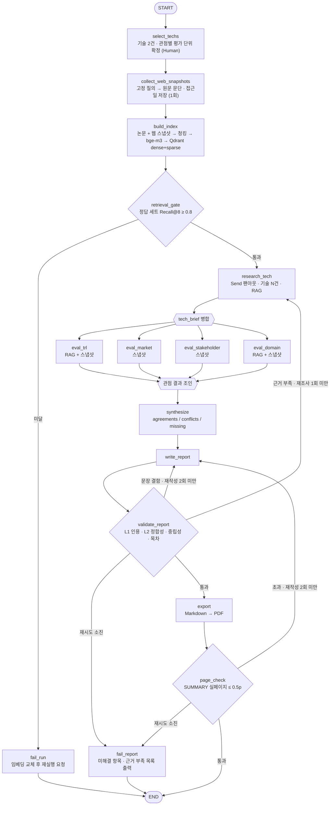

# KV cache 최적화 기술 다관점 평가 — 설계 산출물

SKALA / SK AX · Course AI · Activity 210 · `KV cache 최적화 기술 평가`
제출물 규격: `RAG-Design_{캠퍼스}-{X반}_{이름1+…+이름6}.pdf` · 반별 Slack thread · DAY 3 10:00

> **v2 — 외부 검토 반영본.** 반영 내역은 [부록 A](#부록-a-검토-반영-대조표) 참고.
> 제출 전 채워야 할 값: **캠퍼스**(광주/울산/판교) · **반** · **조원 이름** ·
> 아래 ⚠️ 로 표시한 미대조 항목.

---

## 0. 이 설계가 잡은 축

활동 목적은 "어느 기술이 더 낫다"를 가리는 것이 아니라 **하나의 병목을 다르게 푸는
두 기술이, 보는 관점에 따라 어떻게 다르게 평가받는지**를 드러내는 것이다.
모든 설계 선택을 다음 네 원칙으로 고정했다.

1. **절차 대칭성** — 두 기술에 같은 질의 템플릿·같은 수집 절차·같은 출력 스키마를 쓴다.
   **근거 "개수"를 맞추지는 않는다.** 자료량 차이 자체가 평가 결과이고, 개수를 억지로 맞추면
   한쪽의 약한 근거를 끌어올려 거짓 균형(false balance)을 만든다. 대신 §3.3 처럼
   **근거의 단위와 출처 종류를 구분 표기**한다.
2. **근거 귀속** — 모든 저자 문장은 `evidence_id` 로 근거 객체를 참조한다. 근거 객체에는
   원문 위치(페이지·청크) 또는 웹 스냅샷 위치와 **원문 구절**이 들어 있어, 인용 표식의
   존재뿐 아니라 **근거가 주장을 실제로 뒷받침하는지**까지 검사한다 (§2.6).
3. **관점 분리** — 4개 관점 결과를 State 의 서로 다른 키에 담고, 상충을 지우지 않고
   `conflicts` 로 보존한다. **결측은 상충이 아니다** — 수집 실패는 `missing` 으로 따로 적는다 (§3.6).
4. **재현성** — 같은 입력에 같은 보고서가 나와야 한다. 웹 근거는 실행마다 달라지므로
   **1회 수집 후 스냅샷으로 고정**하고, 이후 실행은 스냅샷만 읽는다 (§2.7).

---

## 1. 대상 기술

### 1.1 선정 결과

| 진영 | 평가 대상 시스템 | 1차 근거 원문 | 접근의 성격 |
|---|---|---|---|
| **SW — 데이터를 작게 만들자** | **MLA (Multi-head Latent Attention)** | DeepSeek-V2: A Strong, Economical, and Efficient MoE Language Model (2024-06) | 어텐션 구조를 재설계해 KV 를 저차원 잠재공간으로 압축 |
| **HW — 담을 공간을 넓히자** | **ITME (CXL-Hybrid 계층적 메모리 확장)** | ITME: Inference Tiered Memory Expansion with Disaggregated CXL-Hybrid Memories (2026-06) | 신규 메모리 계층을 도입해 KV·가중치를 HBM 밖으로 배치 |

**문제를 좁혀 정의한다** — 두 기술은 *"같은 KV 작업에 대한 정반대 해법"* 이 아니다.
**장문맥·다중 턴 서빙에서 KV 용량 압박을 줄이는 서로 다른 접근**이며, 영향을 주는
KV 의 종류가 다르다. 기술 개요 장에서 각 기술이 어떤 KV(지연 민감 working KV /
누적·재사용 KV)에 작용하는지 **반드시 명시**한다.

### 1.2 관점별 평가 단위 — 단위를 하나로 못 박지 않는다

같은 기술이라도 관점마다 "무엇을 재는가"가 다르다. 단위를 하나로 고정하면
CXL 생태계 전체의 양산 실적이 ITME 개별 시스템의 성숙도로 둔갑한다.

| 관점 | 평가 단위 | 이유 |
|---|---|---|
| ① 기술 성숙도(TRL) | **시스템** (MLA / ITME) | 특정 시스템이 어느 단계까지 왔는지를 묻는 척도다. 생태계 실적을 섞으면 TRL 이 부풀려진다 |
| ② 시장성 | **접근** (저차원 잠재 압축 / CXL 계층 확장) + 시스템 구분 표기 | 논문 1편에는 시장 자료가 없다. 단 MLA·CXL 일반·ITME 개별을 §3.3 규칙으로 구분해 적는다 |
| ③ 이해관계자 | **접근** | 반응은 개별 논문이 아니라 접근 진영을 향한다 |
| ④ 도메인 적용 | **시스템** 우선, 접근으로 보완 | 배치·비용 조건은 시스템 실험 조건에서 나온다 |

근거 객체는 `unit` 필드로 `system` / `approach` 를 구분해 저장한다 (§2.6).
**`unit=approach` 근거는 TRL 판정에 쓰지 않는다.**

### 1.3 선정 사유

**① 판별 기준은 "신규 메모리 계층 도입 여부"다.**
MLA 는 기존 HW 위에서 모델 구조를 바꿔 KV 자체를 줄이고(정확도 리스크 O, 재학습 필요),
ITME 는 CXL 이라는 **새 메모리 계층을 도입**해 담을 공간을 넓힌다(정확도 손실 X, 신규 인프라 필요).
"SW 개입 여부"를 기준으로 삼지 않는 이유는 §1.4 에 적었다 — 계층 메모리 시스템은
선인출·스케줄링이라는 SW 요소를 반드시 포함하므로, 그 기준으로는 HW 진영 후보가 모두 탈락한다.

**② TRL 위치가 다르다 → 성숙도 관점이 유효한 축이 된다.**
두 기술이 같은 단계에 있으면 성숙도 관점이 아무것도 구분하지 못한다.
구체 단계는 §3.2 의 결정 규칙으로 산정하며, 선정 시점의 예단은 보고서에 싣지 않는다.

**③ 이해관계자 집합이 겹치지 않는다.**
MLA 는 모델 제공자·서빙 프레임워크·추론 서비스 사업자가, CXL 계층 확장은 메모리 반도체·
서버 OEM·표준화 컨소시엄·투자 업계가 이야기한다. 같은 병목을 두고 **서로 다른 산업이
서로 다른 언어로 말하는 상황**이 만들어져, 이해관계자 관점이 다른 관점과 중복되지 않는다.

**④ 배타적이지 않다는 점까지 결론에 쓸 수 있다.**
"작게 만들면 넓은 공간으로 옮기기 쉬워진다"는 상호보완성은 두 기술을 붙여 놓아야 시사점이 된다.

### 1.4 기각한 후보와 사유

| 후보 | 진영 | 기각 사유 |
|---|---|---|
| TurboQuant (2025-04) | SW | 사후 양자화 계열은 KIVI·KVTC 등 후보가 난립해 "SW 진영 대표"로 놓기 어렵다. MLA 는 진영 논리(구조를 바꿔 애초에 작게)를 단일 기술로 대표한다 |
| KIVI (2024-06) | SW | 양자화 계열 **베이스라인** 성격. 평가 대상보다 MLA 의 압축률·정확도를 상대화하는 비교 기준으로 쓰는 편이 낫다 |
| InfiniGen (2024-06) | HW | **신규 메모리 계층을 도입하지 않는다** — 기존 호스트 DRAM 을 쓴다. §1.3① 기준에 따라 진영 대표에서 제외하되, CXL 계층 확장이 대체하려는 **기존 오프로딩 방식의 기준선**으로 인용한다 |
| PIM/CXL (2025-10) | HW | 신규 계층 도입이라는 기준은 충족하나 DIMM-PIM 은 양산 채택 정보가 더 제한적이다. **ITME 대체 1순위 대안**으로 남긴다 |

### 1.5 ⚠️ 원문 대조가 필요한 사항

본 설계는 **`arxiv.org` 접근이 차단된 환경에서 작성**되어 원문을 직접 읽지 못했다.
아래는 외부 검토에서 제공된 지적이며, **PDF 확보 즉시 대조하고 §1.1·§1.3 을 갱신한다.**

| 항목 | 외부 검토 지적 | 반영 상태 |
|---|---|---|
| ITME 의 실제 동작 | 지연 민감 working KV 는 GPU·호스트에 두고, 모델 가중치와 장문맥의 누적·재사용 KV 를 원격 계층으로 보낸다. SW 선인출·스케줄링이 핵심 | §1.1 문제 정의와 §1.3① 판별 기준을 이 전제로 이미 수정. **원문 대조 필요** |
| ITME 성능 수치 | `1.80×` 와 `35.7%` 는 **서로 다른 기준선**에 대한 결과이므로 한 수치처럼 쓰면 안 됨 | 본 설계서는 두 수치를 쓰지 않는다. **보고서 작성 시 기준선 병기 규칙**으로 §3.3 에 반영 |
| MLA 압축률 `93.3%` | 강의 자료 Doc Pool 표기 | 보고서 인용 시 측정 조건 병기. **원문 대조 필요** |

---

## 2. B. 설계

### 2.1 기술 선정 방식 — **(2안) Human 기반**

조가 직접 선정하고 사유를 §1.3 에 명시한다.

1. **평가 단위 정의(§1.2)가 사람의 판단을 요한다.** 어떤 관점을 시스템 단위로 보고 어떤 관점을
   접근 단위로 볼지는 자료 사정을 보고 정하는 문제다. LLM 이 매 실행 다르게 잡으면 보고서
   **구조 자체**가 흔들린다.
2. **선정 1회가 6개 에이전트 입력 전부를 결정한다.** 여기서 흔들리면 이후 산출이 전부 흔들리는데,
   1.5일 일정에서 되돌릴 여유가 없다.
3. **재현성** — 같은 입력에 같은 보고서가 나와야 채점자가 검증할 수 있다.
   웹 근거 쪽 재현성은 §2.7 이 담당한다.

> 문서 풀 200페이지 한정을 선정 사유로 들지 않는다. §2.3 에서 확인했듯 후보 4편을 모두
> 넣어도 제한의 절반이라 **배분할 것이 없다.**

> **(1안) 에이전트 기반을 완전히 버리지는 않는다.** 후보 6건을 기술 조사 에이전트가
> "관점별 근거 확보 가능성" 으로 사전 스코어링한 기록을 보고서 *기술 선정* 장 부록으로 싣는다.
> 최종 확정은 사람이 한다 (= 선정 방식은 2안).

### 2.2 에이전트 명세

가이드 표에서 RAG 여부가 `O` 인 3개 중 **2개(기술 조사·도메인 평가)에 적용**한다 (최소 1개 요건 충족).
가이드 표에 없던 TRL 에이전트는 원문 근거에 한해 RAG 를 함께 쓴다.
각 에이전트의 입력·출력·도구·실패 처리를 함께 고정한다.

| 에이전트 | 그래프 노드 | 입력 | 출력 State 키 | 도구 | RAG | 실패 시 |
|---|---|---|---|---|---|---|
| 🔍 기술 조사 | `research_tech` | `techs[i]` | `tech_brief[tech_id]`, `evidence_pool` | 하이브리드 검색 | **✅ 필수** | 1회 재시도 → `errors` 기록 후 실행 중단 (하류 전부가 이 출력에 의존) |
| 🏅 기술 성숙도(TRL) | `eval_trl` | `tech_brief` | `view_trl` | 검색(논문) + 스냅샷 | **✅ 혼합** | 1회 재시도 → `unavailable` 등록 |
| 📊 시장 평가 | `eval_market` | `tech_brief` | `view_market` | **스냅샷 조회** | ✕ | 동상 |
| 🤝 이해관계자 평가 | `eval_stakeholder` | `tech_brief` | `view_stakeholder` | **스냅샷 조회** | ✕ | 동상 |
| 🏭 도메인 평가 | `eval_domain` | `tech_brief` | `view_domain` | 하이브리드 검색 + 스냅샷 | **✅ 필수** | 동상 |
| ⚖️ 평가 종합 | `synthesize` | `view_*` 4종 | `synthesis` | 없음 | ✕ | 예외 시 즉시 `fail_report` |
| 📝 보고서 생성 | `write_report` | `synthesis`, `evidence_pool` | `report_md` | 없음 | ✕ | 재작성 카운터로 관리 |
| ✅ 보고서 검증 | `validate_report` | `report_md`, `evidence_pool` | `review` | 규칙 + LLM 판정 | ✕ | §4.3 정책 |

**시장 평가를 가이드의 `O` 에서 `✕` 로 바꾼 이유** — 논문에는 시장 규모·채택 현황이 없다.
문서 풀에 RAG 를 걸면 "근거 없음"만 반복 생성된다. 대신 §2.7 의 웹 스냅샷을 1차 근거로 쓴다.
(가이드는 "설계 목적에 따라 추가/변경 가능"으로 열어 두었다.)

**노드 ≠ 에이전트인 것** — `select_techs`(사람), `collect_web_snapshots`(수집기),
`build_index`·`retrieval_gate`(인덱싱), `export`·`page_check`(변환), `fail_report`(종료)는
LLM 에이전트가 아니라 파이프라인 노드다. 역할 분리를 흐리지 않기 위해 명시한다.

### 2.3 문서 풀 (200페이지 한정)

| 순위 | 문서 | 용도 | 페이지 |
|---|---|---|---|
| 1 | DeepSeek-V2 (MLA) | SW 기술 원문 | 52 |
| 2 | ITME (CXL-Hybrid) | HW 기술 원문 | 13 |
| 3 | KIVI | SW 베이스라인 대조 | 15 |
| 4 | InfiniGen | HW 기존 오프로딩 기준선 | 18 |
| | **합계** | | **98** |

**4편 전부를 문서 풀에 넣는다.** 합계 98p 로 제한의 절반이라 배분 규칙이 필요 없다.
필수 2편만 쓰면 65p.

⚠️ 페이지 수는 **외부 검토가 제공한 값**이며 본 환경에서 대조하지 못했다. PDF 확보 시
버전(arXiv vN)과 함께 고정하고, 근거 객체의 `doc_version` 에 기록한다.
**웹 스냅샷(§2.7)이 이 200페이지 한정에 포함되는지는 강사 확인 항목이다 (§6).**

### 2.4 Embedding 모델 — **BAAI/bge-m3** (하이브리드 구현 전제)

선정 기준:

1. **교차언어 검색** — 원문은 영어, 질의·보고서는 한국어다. 한영 교차 검색이 되어야 한다.
2. **어휘 정확 매칭** — 기술 평가는 `MLA`·`CXL`·`KV cache` 같은 고유명사와 표 안 수치를 찾는
   작업이 많다. dense 임베딩만으로는 이런 질의에서 재현율이 떨어진다.
3. **청크 길이 수용** — 표·알고리즘 블록은 자르지 않고 최대 4,000토큰까지 한 청크로 둔다(§2.5).
   512 토큰 모델은 이 경로를 담지 못한다.
4. **라이선스** — 오픈소스 필수(활동 요건).

| 후보 | 최대 길이 | 다국어 | dense+sparse | 라이선스 | 판정 |
|---|---|---|---|---|---|
| **BAAI/bge-m3** | 8192 | 100+ | **동시 산출 O** | MIT | **선정** |
| nlpai-lab/KURE-v1 | 8192 | 한국어 특화 | dense 전용 | MIT | 차선 |
| intfloat/multilingual-e5-large | 512 | 100 | dense 전용 | MIT | 기각 (기준 3) |
| sentence-transformers/all-MiniLM-L6-v2 | 256~512 | 영어 | dense 전용 | Apache-2.0 | 기각 (기준 1·3) |

**bge-m3 선정 사유는 sparse 동시 산출(기준 2) 하나다.** 컨텍스트 길이는 차선 KURE-v1 과
동일(8192)하므로 **선정 근거가 되지 못한다** — 512 토큰 후보를 거르는 데에만 쓴다.
따라서 §2.5 의 하이브리드 검색을 실제로 구현하지 않으면 bge-m3 를 고를 이유가 사라지고,
한국어 질의에 강한 KURE-v1 이 낫다. **하이브리드 구현은 선택이 아니라 이 선정의 전제다.**

**교체 조건** — §2.5 의 정답 세트에서 Recall@8 이 0.8 미만이면 KURE-v1(dense 단독)로 교체하고
재측정한다. 교체 시 §2.4 선정 사유를 교차언어 성능 기준으로 다시 쓴다.

> 모델 카드 수치는 공개 스펙 기준이다. ⚠️ 본 환경은 `huggingface.co` 접근이 차단되어
> 모델 카드를 직접 확인하지 못했다. 인덱싱 직전 재확인한다.

### 2.5 검색 설계와 검증

**청킹** — 섹션 경계 우선, 기본 1,000토큰 / 150토큰 오버랩.
표·알고리즘·수식 블록은 **자르지 않고 최대 4,000토큰까지 한 청크로 유지**한다.
모든 청크는 `doc_id · doc_version · page · chunk_id` 를 메타로 보존한다.

**하이브리드 검색 (구현 명세)**

| 항목 | 결정 |
|---|---|
| 벡터스토어 | Qdrant — 하나의 컬렉션에 dense 벡터와 named sparse 벡터를 함께 저장 |
| dense | bge-m3 `dense_vecs` (1024차원), 코사인 |
| sparse | bge-m3 `lexical_weights` 를 sparse vector 로 저장 (별도 BM25 인덱스 불필요) |
| 융합 | **RRF** — dense top-20, sparse top-20 을 `1/(60+rank)` 합으로 재정렬 |
| 최종 | 상위 **8** 청크를 컨텍스트로 전달 |

**검색 품질 정답 세트** — 인덱싱 후 1회 측정하고 결과를 산출물로 남긴다.

| 유형 | 문항 | 확인하는 것 |
|---|---|---|
| 한국어 질의 → 영어 원문 | 5 | 교차언어 검색 |
| 표·수식 안 수치 찾기 | 5 | 긴 청크 보존과 sparse 매칭 |
| 한계·반론 문장 찾기 | 5 | 균형 검색(§2.6)이 실제로 근거를 찾는지 |

합격선 **Recall@8 ≥ 0.8**. 미달 시 §2.4 교체 조건 발동. 이 게이트를 통과하지 못하면
그래프는 `fail_run` 으로 끝난다 (§4.2) — 검색이 안 되는 상태로 보고서를 만들지 않는다.

### 2.6 근거 객체와 인용 검증

**Evidence 스키마** — 모든 근거는 하나의 `evidence_pool` 에 적재되고, 각 `ViewResult` 는
`evidence_ids` 로 참조만 한다(중복 제거와 검증을 한 곳에서 하기 위해).

| 필드 | 설명 |
|---|---|
| `evidence_id` | `ev_0001` 형식 |
| `source_type` | `paper` / `web` |
| `unit` | `system` / `approach` — §1.2 의 평가 단위. **`approach` 는 TRL 판정에 쓰지 않는다** |
| `tech_id` | `mla` / `itme` |
| `doc_id`·`doc_version`·`page`·`chunk_id` | `source_type=paper` 일 때 **필수** |
| `url`·`site`·`published_at`·`accessed_at`·`snapshot_id` | `source_type=web` 일 때 **필수** |
| `quote_original` | 원문 구절 그대로 (영문이면 영문) |
| `quote_ko` | 한국어 번역. 보고서 본문은 이쪽을 쓰고, 대조는 `quote_original` 로 한다 |
| `claim` | 이 근거가 뒷받침하는 주장 한 문장 |
| `stance` | `support` / `limit` / `neutral` |
| `baseline` | 성능 수치일 때 **기준선 표기**(§1.5 의 `1.80×` 사례 방지). 없으면 `null` |

**균형 수집** — 관점 질의를 *긍정 근거 / 한계·반론* 쌍으로 발행하고, 양쪽에서 **각각 최소 2건**을
얻지 못하면 해당 항목을 `근거 부족` 으로 표기한다. 개수를 기술 간에 맞추지는 않는다(§0 원칙①).

**3단 인용 검증**

| 단계 | 방식 | 검사 내용 |
|---|---|---|
| **L1 기계** | 규칙 | 저자 문장마다 `evidence_id` 1개 이상 · 참조된 id 가 `evidence_pool` 에 실존 · `paper` 는 page/chunk, `web` 은 url/accessed_at 필수 |
| **L2 정합성** | 규칙 + LLM | `quote_original` 이 `claim` 을 실제로 뒷받침하는가를 `support` / `unrelated` / `contradict` 로 판정. `unrelated`·`contradict` 는 반려 |
| **L3 사람** | 수작업 | SUMMARY·시사점에 쓰인 **핵심 주장 상위 10건**을 사람이 원문 페이지로 대조. 체크리스트를 제출 산출물에 포함 |

**중립성(금지 어휘)** — "우수하다 / 더 낫다 / 승자" 등 우열 표현을 정규식으로 잡되,
**인용 블록과 REFERENCE 는 검사 전에 마스킹한다.** DeepSeek-V2 는 "표준 어텐션보다 나은 성능"을
주장하는 논문이고 경쟁사 코멘트도 비교 표현을 담으므로, 마스킹하지 않으면 중립성 장치가
**핵심 근거 인용 자체를 막는다.** 금지 대상은 어디까지나 **저자 문장**이다.

### 2.7 웹 근거 스냅샷 — 재현성 장치

시장·이해관계자·TRL(채택 근거)은 웹 자료에 의존한다. 실시간 검색을 그대로 두면 실행마다
보고서가 달라지고, REFERENCE 가 요구하는 접근일도 채울 근거가 없다.

| 단계 | 내용 |
|---|---|
| 1. 질의 고정 | 관점 × 기술별 검색 질의를 파일로 고정(`queries.yaml`). 에이전트가 즉석에서 만들지 않는다 |
| 2. 1회 수집 | 검색 → 본문 추출 → `{url, site, title, published_at, accessed_at, 원문 문단}` 저장 |
| 3. 저장 | `data/web-snapshots/{snapshot_id}.json` + 수집 로그. **저장소에 커밋**한다 |
| 4. 이후 실행 | 에이전트는 **스냅샷만 조회**한다. 네트워크를 타지 않는다 |
| 5. 색인 | 스냅샷 본문도 논문과 같은 파이프라인으로 청킹·임베딩해 같은 컬렉션에 넣는다 |

5번 덕분에 웹 근거도 논문 근거와 **동일한 Evidence 구조**를 갖고, §2.6 의 L1·L2 검증을
그대로 받는다. 스냅샷을 갱신할 때는 `snapshot_id` 를 새로 발급해 이전 보고서의 근거를 깨지 않는다.

---

## 3. C. 평가 관점 및 기준

**선정 도메인: 데이터센터 · 클라우드 서빙** (대규모, 비용 민감, 멀티테넌시)

선정 사유 — 두 기술 모두의 1차 타깃이고 공개 자료가 가장 두껍다.
*온디바이스 AI* 는 CXL 계층 확장이 애초에 적용 대상이 아니라 한쪽이 "해당 없음"이 되어
비교가 성립하지 않고, *장문맥 애플리케이션* 은 두 기술 모두 유리하다고만 나와 관점이 갈리지 않는다.
두 도메인은 시사점 장에서 보조로만 언급한다.

### 3.1 관점 목록과 평가 단위

| # | 관점 | 평가 단위(§1.2) | State 키 |
|---|---|---|---|
| ① | 기술 성숙도 (TRL) | 시스템 | `view_trl` |
| ② | 시장성 | 접근 (+시스템 구분 표기) | `view_market` |
| ③ | 이해관계자 | 접근 | `view_stakeholder` |
| ④ | 도메인 적용 | 시스템 우선 | `view_domain` |

### 3.2 관점 ① 기술 성숙도 — TRL 기반

| 평가 대상 | 기준 (공개 정보 → TRL 추정) |
|---|---|
| 각 **시스템**의 현재 단계 | 논문·특허만 존재 → **1~3** / 참조 구현 + 벤치마크 재현 → **4** / 유사 환경 통합·서드파티 프레임워크 통합 → **5~6** / 실운용 환경 시연·고객 샘플 공급 → **7~8** / 상용 양산·납품 → **9** |
| 근거 유형 | 논문, 학회 발표, 특허 출원, 오픈소스 저장소, 제품 출시 공지, 실적 공시 |
| 필수 표기 | **공개 정보 기반 추정**임을 단계마다 명시 |

**결정 규칙 (tie-break)** — 위 매핑은 상호배타적이지 않다. MLA 는 "프레임워크 통합(5~6)"과
"실운용 적용(7~8)"이 동시에 참일 수 있다. 규칙이 없으면 에이전트가 실행마다 다른 단계를 내놓는다.

1. 근거 유형별로 단계를 각각 매기고 **최고 단계를 채택**한다.
2. 채택 단계 옆에 **근거 유형을 반드시 병기**한다 — 예: `TRL 7 (근거: 상용 서비스 운영 적용)`.
3. 최고·최저 단계가 **2 이상 벌어지면 범위로 표기**한다 — 예: `TRL 5~7`.
4. **`unit=approach` 근거는 쓰지 않는다.** CXL 생태계 전체의 제품 출시는 ITME 의 TRL 이 아니다.

**TRL 4~6 구간은 자료가 비어 있는 게 정상이다**(수율·공정 파라미터·실성능이 영업 비밀).
근거가 없을 때 "낮은 단계"로 내리지 않고 **`추정 불가`** 로 남긴다. 또한 KV cache 기술은
**논문 발표와 실제 채택 사이에 시차**가 있어 최신 논문일수록 TRL 이 낮게 보이는 편향이 있다.
보고서 한계점 장에 그대로 적는다.

### 3.3 관점 ② 시장성

| 평가 대상 | 기준 | 근거 소스 |
|---|---|---|
| 시장 규모·성장성 | 추정치와 성장률, **추정 주체·기준연도 병기** | 시장 리포트, 산업 뉴스 |
| 상용화·채택 현황 | 도입 사례, 제품 출시 발표 | 벤더 공지, 기술 블로그 |
| 생태계 지지 | 지원 프레임워크, 표준화 동향, 오픈소스 활동 | 표준화 단체, 저장소 |

**표기 규칙 — 근거의 단위를 반드시 구분한다.**

- `MLA(시스템)` / `저차원 잠재 압축(접근)` / `CXL 일반(접근)` / `ITME(시스템)` 중 어느 것에 대한
  자료인지 문장마다 밝힌다. Evidence 의 `unit` 필드가 근거를 제공한다.
- **성능 수치는 기준선을 병기한다.** `1.80×`, `35.7%` 처럼 기준선이 다른 수치를 한 성능처럼
  나열하지 않는다 (Evidence `baseline` 필드 필수).
- 자료량이 한쪽에 몰리면 **그 사실 자체를 적는다.** 억지로 개수를 맞추지 않는다(§0 원칙①).

### 3.4 관점 ③ 이해관계자

| 평가 대상 | 기준 | 근거 소스 |
|---|---|---|
| 경쟁 기술 진영 | 반대 진영의 반응, 대응 기술 발표 | 경쟁사 발표, 기술 블로그 |
| 도입 기업·개발자 | 도입 의견, 채택 장벽(재학습 비용 / 인프라 교체 비용) | 커뮤니티, 이슈 트래커, 인터뷰 |
| 투자 업계 | 투자 동향, 애널리스트·미디어 평가 | 투자 리포트, 미디어 |

### 3.5 관점 ④ 도메인 적용 — 데이터센터·클라우드

| 평가 대상 | 기준 |
|---|---|
| 비용 구조 | HBM 절감분 vs 신규 인프라·재학습 투자 |
| 멀티테넌시 | 한 사용자의 KV 가 다른 사용자 몫 메모리를 잠식하는 정도 |
| 지연·SLA | 압축/복원 오버헤드 vs 계층 간 전송 지연 (TTFT·TPOT 영향) |
| 운영 복잡도 | 기존 서빙 스택 변경 범위, 모델 교체 필요 여부 |
| 정확도 | 손실 여부와 허용 범위 |
| **작용하는 KV 종류** | 지연 민감 working KV / 누적·재사용 KV 중 어디에 작용하는지 (§1.1) |

### 3.6 종합 — 상충과 결측을 구분한다

관점별 결론을 **세 묶음**으로 나눠 기록한다.

| 묶음 | 내용 |
|---|---|
| `agreements` | 관점들이 같은 방향으로 말하는 것 |
| `conflicts` | `{관점A 주장, 관점B 주장, 각각의 근거, 왜 갈리는지}` 4요소 보존. **해소하지 않는다** |
| `missing` | 수집 실패·근거 부족·`unavailable` 관점. **상충으로 계상하지 않는다** |

결측을 상충에 섞으면 "관점에 따라 갈린다"가 진짜 대립인지 자료 부재인지 구분되지 않는다.
보고서 *시사점* 장은 `conflicts` 로, *한계점* 장은 `missing` 으로 쓴다.

---

## 4. D. 그래프 설계(안)

### 4.1 State 설계

병렬 구간에서 여러 노드가 거의 동시에 State 를 갱신한다.
**관점별 결과를 각각 다른 키로 분리**해 충돌을 원천 차단하고, 여러 노드가 함께 쓰는 키에만 리듀서를 단다.

| 키 | 타입 | 리듀서 | 생산 노드 | 비고 |
|---|---|---|---|---|
| `topic` | `str` | 기본 | 입력 | 고정 |
| `domain` | `str` | 기본 | 입력 | `datacenter` |
| `techs` | `list[TechSpec]` | 기본 | `select_techs` | 2건. `{id, camp, 시스템명, 원문, 선정사유, 평가단위}` |
| `snapshots` | `dict[snapshot_id, Snapshot]` | 기본 | `collect_web_snapshots` | §2.7. 1회 생성 후 불변 |
| `corpus` | `CorpusMeta` | 기본 | `build_index` | 문서 수, 페이지 합계, 청크 수, `embed_model` |
| `retrieval_score` | `float` | 기본 | `retrieval_gate` | 정답 세트 Recall@8 |
| `evidence_pool` | `dict[evidence_id, Evidence]` | `add_unique` | 근거 수집 노드 전부 | **병렬 동시 append** — id 기준 중복 제거 |
| `tech_brief` | `dict[tech_id, TechBrief]` | `merge_by_key` | `research_tech` (**Send 팬아웃**) | 기술별 병렬 → tech_id 로 분리 |
| `view_trl` | `dict[tech_id, ViewResult]` | 기본 | `eval_trl` | **관점 전용 키** |
| `view_market` | `dict[tech_id, ViewResult]` | 기본 | `eval_market` | **관점 전용 키** |
| `view_stakeholder` | `dict[tech_id, ViewResult]` | 기본 | `eval_stakeholder` | **관점 전용 키** |
| `view_domain` | `dict[tech_id, ViewResult]` | 기본 | `eval_domain` | **관점 전용 키** |
| `unavailable` | `list[str]` | `operator.add` | 관점 노드 | 재시도 후에도 실패한 관점. `missing` 으로 흘러간다 |
| `synthesis` | `Synthesis` | 기본 | `synthesize` | `agreements / conflicts / missing` |
| `report_md` | `str` | 기본 | `write_report` | |
| `review` | `ReviewResult` | 기본 | `validate_report` | `{fail_kind, items[]}` — `fail_kind` 가 분기를 결정 |
| `revision` | `int` | `operator.add` | `validate_report`·`page_check` | 재작성 **최대 2회** (두 노드가 공유) |
| `research_retry` | `int` | `operator.add` | `validate_report` | 조사 복귀 **최대 1회** |
| `references` | `list[Reference]` | `add_unique` | 근거 수집 노드 전부 | URL·서지 기준 중복 제거 |
| `errors` | `list[str]` | `operator.add` | 전체 | 노드 실패를 삼키지 않고 누적 |

`ViewResult` 공통 스키마 — `{verdict, evidence_ids[], confidence, unknown[], unit}`.
근거 본문은 `evidence_pool` 에만 두고 여기서는 id 로 참조한다.
네 관점이 같은 스키마를 쓰므로 종합 노드가 관점 간 대조를 형식적으로 수행할 수 있다.

**팬아웃은 `Send` 기반 동적 맵으로 고정한다.** 정적 2노드로 그리면 기술이 3건으로 늘 때
그래프를 고쳐야 한다. `research_tech` 는 하나의 노드 정의이고, `techs` 길이만큼 `Send` 로 분기한다.

### 4.2 Graph 흐름

**흐름 설명** — 정보 수집 → 분석 → 평가 → 보고서의 순차 골격 위에, 독립적인 두 구간만 병렬로 편다.

1. **기술별 팬아웃**(`research_tech`) — 두 기술을 같은 프롬프트로 동시에 조사한다. 절차 대칭성을 구조로 보장한다.
2. **관점별 팬아웃**(평가 4종) — 서로를 참조하지 않아야 관점 독립성이 유지된다. 한 관점이 다른
   관점의 결론을 보면 의견이 수렴해 버려 "관점에 따라 갈린다"가 사라진다.
3. **검증은 두 지점에서 한다.** `validate_report` 는 Markdown 단계라 페이지 수를 알 수 없으므로
   글자 수 대리 지표까지만 보고, **실제 ½페이지 판정은 PDF 변환 뒤 `page_check` 가** 한다.
4. **모든 분기가 종단을 갖는다.** 재시도가 소진되면 `fail_report` 로 내려가 **미해결 항목과
   근거 부족 목록을 출력하고 끝낸다.** 조용히 멈추거나 근거 없이 통과시키지 않는다.

### 4.3 실패 · 재시도 정책

| 실패 유형 | 탐지 지점 | 처리 | 소진 시 |
|---|---|---|---|
| 검색 품질 미달 | `retrieval_gate` | 없음 (즉시 중단) | `fail_run` — 사람이 임베딩 교체 후 재실행 |
| 기술 조사 노드 예외 | `research_tech` | 1회 재시도 | 실행 중단 (하류 전부가 의존) |
| 관점 노드 예외·타임아웃 | `eval_*` | 1회 재시도 | `unavailable` 등록 → `missing` 으로 보고 |
| 근거 부족 (긍정/반론 각 2건 미달) | 수집 카운트 | 질의 확장 1회 | 항목을 `근거 부족` 으로 표기 |
| L1·L2 인용 검증 실패 (문장 문제) | `validate_report` | `write_report` 재작성 (`revision` < 2) | `fail_report` |
| L2 실패 중 **근거 자체가 없는 경우** | `validate_report` | `research_tech` 복귀 (`research_retry` < 1) | `fail_report` |
| SUMMARY 실페이지 초과 | `page_check` | `write_report` 재작성 (`revision` 공유) | `fail_report` |

**`fail_report` 는 실패를 감추지 않는다** — 통과하지 못한 검증 항목, `missing` 목록,
`근거 부족` 항목을 그대로 출력한다. 근거가 없는 보고서를 내보내는 것보다 낫다.

---

## 5. E. 평가 보고서 목차(초안)

맨 앞 `SUMMARY`, 맨 뒤 `REFERENCE` 고정.

| # | 장 | 내용 | 분량 |
|---|---|---|---|
| 1 | **SUMMARY** | 관점별로 평가가 갈린 지점 위주의 핵심 요약. 개요가 아니다 | **½페이지 이내** (`page_check` 가 실측) |
| 2 | 분석 배경 | KV cache 가 연산 병목을 메모리 병목으로 바꾼 구조, 두 진영의 접근이 갈린 이유 | 1p |
| 3 | 기술 선정 | 선정 2건과 사유, 기각 후보와 사유, **관점별 평가 단위**, (부록) 에이전트 사전 스코어링 | 1p |
| 4 | 기술 개요 | 4.1 MLA / 4.2 ITME — 각 접근·효과·한계와 **작용하는 KV 종류** | 2p |
| 5 | 관점별 평가 | 5.1 TRL(근거 유형 병기) / 5.2 시장성(단위·기준선 병기) / 5.3 이해관계자 / 5.4 도메인 | 4p |
| 6 | 시사점 | `conflicts` 기반. 관점이 엇갈리는 지점과 그 이유 | 1~2p |
| 7 | 한계점 | 공개 정보 추정의 한계, TRL 4~6 공백, 논문–채택 시차, `missing` 목록, 확증편향 방지 조치(균형 수집·3단 인용 검증·인용 마스킹·웹 스냅샷 고정) | 1p |
| 8 | **REFERENCE** | 실제 인용된 `evidence_id` 가 가리키는 자료만 | — |

**REFERENCE 표기 형식**

- 특허 — 출원인(YYYY-MM). 특허명, 특허번호/공개번호, URL
- 논문 — 저자(YYYY). 논문제목. 학술지/학회명, 권(호), 페이지.
- 기타(웹) — 기관명 또는 작성자(YYYY-MM-DD). 제목. 사이트명, URL

웹 항목의 날짜는 Evidence 의 `published_at`·`accessed_at` 에서 채운다(§2.7 덕분에 값이 존재한다).
보고서에 인용되지 않은 항목은 출력 단계에서 제거한다 ("실제로 활용한 자료 목록만" 요건).

---

## 6. 미확정 항목

| 항목 | 상태 |
|---|---|
| 캠퍼스 · 반 · 조원 6인 이름 | 제출 파일명에 필요 — **미정** |
| 문서 풀 페이지 수 (52/13/15/18 = 98) | ⚠️ 외부 검토 제공값. PDF 확보 후 버전과 함께 고정 |
| 원문 arXiv ID · 서지 | ⚠️ 본 환경에서 `arxiv.org` 차단으로 대조 못 함 |
| ITME 의 실제 동작·성능 기준선 | ⚠️ §1.5 참고. 원문 대조 후 §1.1·§1.3 갱신 |
| MLA `93.3%` 등 강의 자료 수치 | ⚠️ 원문 대조 후 측정 조건 병기 |
| bge-m3 / KURE-v1 모델 카드 스펙 | ⚠️ `huggingface.co` 차단으로 미확인 |
| **웹 스냅샷이 200페이지 한정에 포함되는지** | **강사 확인 필요** — 포함이면 스냅샷 분량을 제한해야 한다 |
| HW 기술 최종 확정 | ITME 기준. PIM/CXL 로 교체 시 §1.1·§1.4·§2.3 만 수정하면 나머지 설계는 그대로 유효 |

---

## 부록 A. 검토 반영 대조표

| # | 지적 | 반영 위치 |
|---|---|---|
| 1 | 비교 대상 경계가 흔들린다 (ITME 는 working KV 를 GPU 에 두고 SW 선인출이 핵심) | §1.1 문제 정의 축소, §1.3① 판별 기준을 "신규 메모리 계층 도입 여부"로 교체, §1.5 대조 항목, §3.5 "작용하는 KV 종류" |
| 1' | CXL 생태계 채택을 ITME 성숙도 근거로 쓰지 말 것 | §1.2 관점별 평가 단위 표, §3.2 결정 규칙 4, Evidence `unit` 필드 |
| 2 | 근거 스키마가 인용 검증을 못 받친다 | §2.6 Evidence 스키마(page·chunk·quote_original), 3단 검증(L1/L2/L3), §4.1 `evidence_pool` |
| 3 | 하이브리드 구현 단계 누락, 8192 근거 무력 | §2.4 선정 사유를 sparse 동시 산출로 재작성 + 교체 조건, §2.5 Qdrant·RRF 명세, 정답 세트 |
| 4 | 그래프에 실패 종료 경로가 없다 / ½페이지 판정 불가 | §4.2 `fail_run`·`fail_report`·`page_check` 3경로, §4.3 정책표 |
| 부차 | 에이전트 I/O·도구·실패 처리 미정의, 노드와 에이전트 혼재 | §2.2 명세표 + "노드 ≠ 에이전트" 문단 |
| 부차 | 같은 근거 수 ≠ 공정성 | §0 원칙① 재작성, §3.3 단위·기준선 병기 규칙 |
| 부차 | `1.80×` 와 `35.7%` 혼용 금지 | Evidence `baseline` 필수 필드, §3.3 |
| 즉시 | 페이지 수 98p | §2.3 확정(⚠️ 미대조 표기), §2.1 에서 200p 논거 삭제 |
| 자체 | 재현성 논거가 웹 검색 설계 부재로 무너짐 | §2.7 스냅샷 고정, §2.1 사유 재작성 |
| 자체 | TRL 기준표가 판정을 결정하지 못함 | §3.2 tie-break 4개 규칙 |
| 자체 | 금지 어휘 정규식이 핵심 인용을 오탐 | §2.6 인용 블록 마스킹 |
| 자체 | 팬아웃 구현 방식이 State 표와 그래프에서 엇갈림 | §4.1 `Send` 기반 동적 팬아웃으로 고정 |
| 자체 | 실패 처리 정책 부재, 결측과 상충 혼동 | §3.6 `missing` 분리, §4.3 정책표, `unavailable` 키 |
| 자체 | 언어 정책 부재 | Evidence `quote_original` + `quote_ko` |
| 자체 | 200p 에 웹 근거 포함 여부 불명 | §6 강사 확인 항목 |
