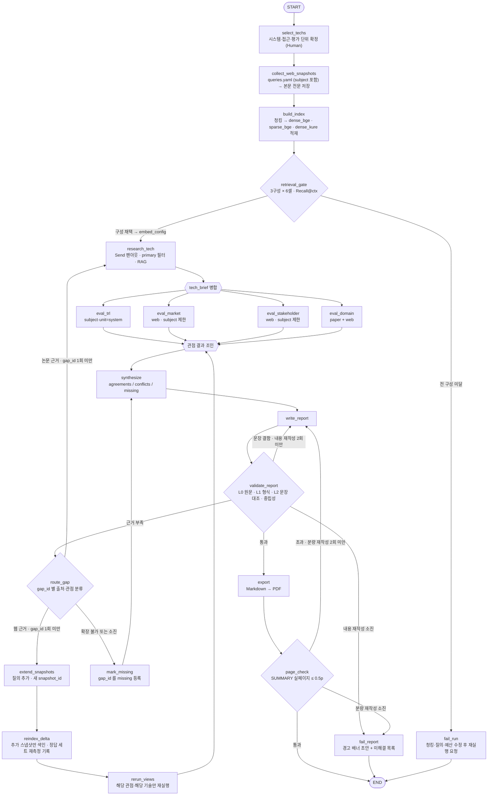

# KV cache 최적화 기술 다관점 평가 — 설계 산출물

SKALA / SK AX · Course AI · Activity 210 · `KV cache 최적화 기술 평가`
제출물 규격: `RAG-Design_{캠퍼스}-{X반}_{이름1+…+이름6}.pdf` · 반별 Slack thread · DAY 3 10:00

> **v4 — 3차 외부 검토 반영본.** 반영 내역은 [부록 A](#부록-a-검토-반영-대조표) 참고.
> 제출 전 채워야 할 값: **캠퍼스**(광주/울산/판교) · **반** · **조원 이름** · §1.5 의 미확인 항목.

---

## 0. 이 설계가 잡은 축

활동 목적은 "어느 기술이 더 낫다"를 가리는 것이 아니라 **하나의 병목을 다르게 푸는
두 기술이, 보는 관점에 따라 어떻게 다르게 평가받는지**를 드러내는 것이다.

1. **절차 대칭성** — 두 기술에 같은 질의 템플릿·같은 수집 절차·같은 출력 스키마를 쓴다.
   **근거 "개수"를 맞추지는 않는다.** 자료량 차이 자체가 평가 결과이고, 개수를 억지로 맞추면
   한쪽의 약한 근거를 끌어올려 거짓 균형(false balance)을 만든다.
2. **근거 귀속** — 검증 대상은 **보고서에 실제로 쓰인 문장**이다. 그리고 그 문장이 딛고 선
   인용문이 **정말 원문에 있는 문자열인지**까지 기계로 확인한다. 에이전트는 인용문을
   **쓰지 않고 좌표만 고른다** (§2.6).
3. **관점 분리** — 4개 관점 결과를 State 의 서로 다른 키에 담고, 상충을 지우지 않고
   `conflicts` 로 보존한다. **결측은 상충이 아니다** (§3.6).
4. **재현성과 복구의 양립** — 웹 근거는 스냅샷으로 고정하되, 근거가 부족하면 질의를 추가하고
   새 스냅샷 버전을 발급해 확장한다. 고정은 한 실행 안의 불변을 뜻하지 정지를 뜻하지 않는다 (§2.7).
5. **측정은 최종 입력 기준으로 한다** — 검색이 잘 뽑아도 컨텍스트 예산에서 잘리면 보고서는
   그 근거를 못 본다. 합격 판정은 **실제로 생성기에 전달된 청크**로 한다 (§2.5).

---

## 1. 대상 기술

### 1.1 선정 결과

| 진영 | 평가 대상 시스템 (TRL 단위) | 접근 (시장·이해관계자 단위) | 1차 근거 원문 |
|---|---|---|---|
| **SW — 데이터를 작게 만들자** | **DeepSeek-V2 의 MLA 구현** | 저차원 잠재 압축 (Multi-head Latent Attention) | DeepSeek-V2: A Strong, Economical, and Efficient MoE Language Model (2024-06) |
| **HW — 담을 공간을 넓히자** | **ITME** | CXL-Hybrid 계층적 메모리 확장 | ITME: Inference Tiered Memory Expansion with Disaggregated CXL-Hybrid Memories (2026-06) |

**시스템과 접근을 이름 단위로 분리한다.** MLA 는 어텐션 기법이지 시스템이 아니므로
그 자체에 TRL 을 매기지 않는다. TRL 대상은 **"DeepSeek-V2 의 MLA 구현"** 이다 (§1.2).

**문제를 좁혀 정의한다** — 두 기술은 *"같은 KV 작업에 대한 정반대 해법"* 이 아니다.
**장문맥·다중 턴 서빙에서 KV 용량 압박을 줄이는 서로 다른 접근**이며, 영향을 주는
KV 의 종류가 다르다. 기술 개요 장에서 각 기술이 어떤 KV(지연 민감 working KV /
누적·재사용 KV)에 작용하는지 **반드시 명시**한다.

### 1.2 관점별 평가 단위

| 관점 | 평가 단위 | 구체 대상 | 이유 |
|---|---|---|---|
| ① 기술 성숙도(TRL) | **시스템** | `DeepSeek-V2 의 MLA 구현` / `ITME` | 특정 구현이 어느 단계까지 왔는지를 묻는 척도다. 생태계 실적을 섞으면 TRL 이 부풀려진다 |
| ② 시장성 | **접근** + 시스템 구분 표기 | `저차원 잠재 압축` / `CXL 계층 확장` | 논문 1편에는 시장 자료가 없다. 단 §3.3 규칙으로 단위를 구분해 적는다 |
| ③ 이해관계자 | **접근** | 동상 | 반응은 개별 논문이 아니라 접근 진영을 향한다 |
| ④ 도메인 적용 | **시스템** 우선, 접근으로 보완 | 동상 | 배치·비용 조건은 시스템 실험 조건에서 나온다 |

근거 객체는 `unit`(`system`/`approach`)과 `subject`(어느 기술 이야기인지)를 따로 저장한다.
**`unit=approach` 근거는 TRL 판정에 쓰지 않는다.**

### 1.3 선정 사유

**① 판별 기준은 "신규 메모리 계층 도입 여부"다.**
MLA 구현은 기존 HW 위에서 모델 구조를 바꿔 KV 자체를 줄이고(정확도 리스크 O, 재학습 필요),
ITME 는 CXL 이라는 **새 메모리 계층을 도입**해 담을 공간을 넓힌다(정확도 손실 X, 신규 인프라 필요).
"SW 개입 여부"를 기준으로 삼지 않는 이유는 §1.4 에 있다 — 계층 메모리 시스템은
선인출·스케줄링이라는 SW 요소를 반드시 포함하므로, 그 기준으로는 HW 진영 후보가 모두 탈락한다.

**② TRL 위치가 다르다 → 성숙도 관점이 유효한 축이 된다.**
두 기술이 같은 단계에 있으면 성숙도 관점이 아무것도 구분하지 못한다.
구체 단계는 §3.2 의 결정 규칙으로 산정하며, 선정 시점의 예단은 보고서에 싣지 않는다.

**③ 이해관계자 집합이 겹치지 않는다.**
저차원 잠재 압축은 모델 제공자·서빙 프레임워크·추론 서비스 사업자가, CXL 계층 확장은
메모리 반도체·서버 OEM·표준화 컨소시엄·투자 업계가 이야기한다.

**④ 배타적이지 않다는 점까지 결론에 쓸 수 있다.**
"작게 만들면 넓은 공간으로 옮기기 쉬워진다"는 상호보완성은 두 기술을 붙여 놓아야 시사점이 된다.

### 1.4 기각한 후보와 사유

| 후보 | 진영 | 기각 사유 | 문서 풀 역할 |
|---|---|---|---|
| TurboQuant (2025-04) | SW | 사후 양자화 계열은 KIVI·KVTC 등 후보가 난립해 "SW 진영 대표"로 놓기 어렵다 | 미포함 |
| KIVI (2024-06) | SW | 양자화 계열 **베이스라인** 성격 | `role=baseline` |
| InfiniGen (2024-06) | HW | **신규 메모리 계층을 도입하지 않는다** — 기존 호스트 DRAM 을 쓴다 | `role=baseline` |
| PIM/CXL (2025-10) | HW | 신규 계층 도입 기준은 충족하나 DIMM-PIM 은 양산 채택 정보가 더 제한적이다. **ITME 대체 1순위 대안** | 미포함 |

`role=baseline` 문서는 **비교 인용 전용**이다. 평가 대상의 TRL·시장 판정 근거로 쓰지 않는다 (§2.5).

### 1.5 원문 대조 상태

본 설계는 `arxiv.org`·`huggingface.co` 접근이 차단된 환경에서 작성되어
**작성자가 직접 대조한 값이 하나도 없다.** 확인 주체를 구분해 적는다.

**(a) 외부 검토가 확인했다고 보고한 값 — 팀이 PDF 로 재확인할 것**

| 항목 | 확인 내용 | 보고서 반영 규칙 |
|---|---|---|
| DeepSeek-V2 PDF | **v5, 52쪽** | 인용 시 `doc_version=v5` 고정 |
| ITME PDF | **v2, 13쪽** | 인용 시 `doc_version=v2` 고정 |
| MLA `93.3%` | **DeepSeek 67B 대비** | 기준선 없이 쓰지 않는다 (`baseline` 필수) |
| ITME `1.80×` | **NVMe-oF 계열 기준선** 대비 | 동상 |
| ITME `35.7%` | **CPU 오프로딩 기준선** 대비 | 동상. `1.80×` 와 **한 성능처럼 나열하지 않는다** |
| ITME 동작 | 지연 민감 working KV 는 GPU·호스트에 잔류, 가중치와 누적·재사용 KV 를 원격 계층으로. **SW 선인출·스케줄링이 핵심** | §1.1·§1.3① 이 이 전제로 작성됨 |

**(b) 아직 아무도 확인하지 않은 값**

| 항목 | 상태 |
|---|---|
| KIVI 15쪽 · InfiniGen 18쪽 | 외부 검토 제공값, 버전 미기재 |
| 네 편의 arXiv ID·정식 서지 | REFERENCE 작성 전 필수 |
| bge-m3 · KURE-v1 모델 카드 스펙 | `huggingface.co` 차단으로 미확인 |
| Qdrant 내장 RRF 기본 상수 | §2.5 는 **클라이언트 RRF 로 회피**하므로 설계 정합성에는 영향 없음 |

---

## 2. B. 설계

### 2.1 기술 선정 방식 — **(2안) Human 기반**

1. **평가 단위 정의(§1.2)가 사람의 판단을 요한다.** 어떤 관점을 시스템 단위로 보고 어떤 관점을
   접근 단위로 볼지는 자료 사정을 보고 정하는 문제다. LLM 이 매 실행 다르게 잡으면 보고서
   **구조 자체**가 흔들린다.
2. **선정 1회가 6개 에이전트 입력 전부를 결정한다.** 1.5일 일정에서 되돌릴 여유가 없다.
3. **재현성** — 같은 입력에 같은 보고서가 나와야 채점자가 검증할 수 있다.

> 문서 풀 200페이지 한정은 선정 사유가 아니다. §2.3 처럼 후보 4편을 모두 넣어도 제한의
> 절반이라 **배분할 것이 없다.**

> **"후보 6건 사전 스코어링" 약속은 삭제했다.** 그래프는 사람이 두 기술을 먼저 확정한 뒤
> 기술 조사를 실행하고, 문서 풀에도 후보 6편 중 4편만 있다. 그 흐름으로 만든 점수는
> **선정 이후에 생성된 값이라 선정 근거가 될 수 없다.** 선정 방식은 온전히 2안이다.

### 2.2 에이전트 명세

가이드 표에서 RAG 여부가 `O` 인 3개 중 **2개(기술 조사·도메인 평가)에 적용**한다 (최소 1개 요건 충족).
가이드 표에 없던 TRL 에이전트는 원문 근거에 한해 RAG 를 함께 쓴다.

| 에이전트 | 그래프 노드 | 입력 | 출력 State 키 | 검색 범위(§2.5) | RAG | 실패 시 |
|---|---|---|---|---|---|---|
| 🔍 기술 조사 | `research_tech` | `techs[i]`, `gap_requests` | `tech_brief[tech_id]`, `evidence_pool` | `primary` 원문 (기준선은 비교 질의 한정) | **✅ 필수** | 1회 재시도 → 실행 중단 (하류 전부가 의존) |
| 🏅 기술 성숙도(TRL) | `eval_trl` | `tech_brief` | `view_trl` | `subject=<tech>` ∧ `unit=system` | **✅ 혼합** | 1회 재시도 → `missing(node_failed)` |
| 📊 시장 평가 | `eval_market` | `tech_brief` | `view_market` | `web` ∧ `subject ∈ {<tech>, general}` | ✕ | 동상 |
| 🤝 이해관계자 평가 | `eval_stakeholder` | `tech_brief` | `view_stakeholder` | 동상 | ✕ | 동상 |
| 🏭 도메인 평가 | `eval_domain` | `tech_brief` | `view_domain` | `paper(<tech>)` + `web` | **✅ 필수** | 동상 |
| ⚖️ 평가 종합 | `synthesize` | `view_*` 4종 | `synthesis` | — | ✕ | 예외 시 `fail_report` |
| 📝 보고서 생성 | `write_report` | `synthesis`, `evidence_pool` | `report_md` | — | ✕ | 재작성 카운터로 관리 |
| ✅ 보고서 검증 | `validate_report` | `report_md`, `evidence_pool` | `review`, `gap_requests` | — | ✕ | §4.3 정책 |

**시장 평가를 가이드의 `O` 에서 `✕` 로 바꾼 이유** — 논문에는 시장 규모·채택 현황이 없다.
문서 풀에 RAG 를 걸면 "근거 없음"만 반복 생성된다. 대신 §2.7 의 웹 스냅샷을 1차 근거로 쓴다.
(가이드는 "설계 목적에 따라 추가/변경 가능"으로 열어 두었다.)

**노드 ≠ 에이전트인 것** — `select_techs`(사람), `collect_web_snapshots`·`extend_snapshots`(수집기),
`build_index`·`reindex_delta`·`retrieval_gate`(인덱싱), `route_gap`·`mark_missing`(라우팅),
`export`·`page_check`(변환), `fail_run`·`fail_report`(종료)는 LLM 에이전트가 아니다.

### 2.3 문서 풀 (200페이지 한정)

| 순위 | 문서 | 버전 | `subject` | `role` | 페이지 |
|---|---|---|---|---|---|
| 1 | DeepSeek-V2 (MLA) | v5 | `mla_deepseek_v2` | `primary` | 52 |
| 2 | ITME (CXL-Hybrid) | v2 | `itme` | `primary` | 13 |
| 3 | KIVI | ⚠️ 미확인 | `general` | `baseline` | 15 |
| 4 | InfiniGen | ⚠️ 미확인 | `general` | `baseline` | 18 |
| | **합계** | | | | **98** |

4편 전부를 넣는다. 합계 98p 로 제한의 절반이라 배분 규칙이 필요 없다. 필수 2편만 쓰면 65p.
모든 근거는 `doc_version` 을 함께 기록한다 — 버전이 바뀌면 페이지 번호가 어긋난다.
페이지 수 출처와 확인 상태는 §1.5.

**웹 스냅샷(§2.7)이 이 200페이지 한정에 포함되는지는 강사 확인 항목이다 (§6).**

### 2.4 Embedding 모델 — bge-m3 우선, **측정 후 확정**

선정 기준:

1. **교차언어 검색** — 원문은 영어, 질의·보고서는 한국어다.
2. **어휘 정확 매칭** — `MLA`·`CXL`·표 안 수치 같은 질의가 많아 dense 단독은 재현율이 떨어진다.
3. **청크 길이 수용** — 표·알고리즘 블록은 최대 4,000토큰까지 한 청크로 둔다(§2.5). 512 토큰 모델은 불가.
4. **라이선스** — 오픈소스 필수(활동 요건).

| 후보 | 최대 길이 | 다국어 | dense+sparse | 라이선스 | 판정 |
|---|---|---|---|---|---|
| **BAAI/bge-m3** | 8192 | 100+ | **동시 산출 O** | MIT | 1순위 |
| nlpai-lab/KURE-v1 | 8192 | 한국어 특화 | dense 전용 | MIT | 비교 대상 |
| intfloat/multilingual-e5-large | 512 | 100 | dense 전용 | MIT | 기각 (기준 3) |
| sentence-transformers/all-MiniLM-L6-v2 | 256~512 | 영어 | dense 전용 | Apache-2.0 | 기각 (기준 1·3) |

**bge-m3 를 1순위로 둔 근거는 sparse 동시 산출(기준 2) 하나다.** 컨텍스트 길이는 KURE-v1 과
동일(8192)하므로 둘을 가르지 못하고, 512 토큰 후보를 거르는 데에만 쓴다.

**교체 판단은 측정으로 한다 — 자동 대체 규칙을 두지 않는다.**
"KURE-v1 이 한국어에 강하다"는 모델 카드의 주장은 **한국어 질의 → 영어 논문 검색**이
bge-m3 보다 낫다는 증거가 아니다.

| 구성 | 사용하는 문서 벡터 | 의미 |
|---|---|---|
| A. bge-m3 dense 단독 | `dense_bge` | 교차언어만 |
| B. bge-m3 hybrid (dense+sparse, RRF) | `dense_bge` + `sparse_bge` | 1순위 안 |
| C. KURE-v1 dense 단독 | **`dense_kure`** | 교차언어 특화, **sparse 포기** |

**C 를 재려면 KURE 로 만든 문서 벡터가 있어야 한다.** KURE 질의를 bge 문서 벡터와 비교하는 것은
측정이 아니다 — 그래서 `build_index` 가 두 모델의 문서 벡터를 모두 만든다 (§2.5).
**C 채택은 곧 하이브리드 포기**이므로, 선택 시 "어휘 정확 매칭을 포기하고 교차언어 재현율을
택한다"는 트레이드오프를 측정 표에 함께 적는다.

**합격선은 §2.5 의 `Recall@ctx` 로 판정한다** — 전체 ≥ 0.8 **그리고**
`기술(2) × 질문 유형(3)` 6개 셀이 각각 ≥ 0.6.
합격 구성이 둘 이상이면 셀 최저값이 높은 쪽을 쓴다. 전부 미달이면 `fail_run` 으로 끝내고
사람이 청킹·질의·예산을 손본 뒤 다시 잰다.

> ⚠️ 모델 카드 수치는 공개 스펙 기준이며 `huggingface.co` 차단으로 확인하지 못했다(§1.5b).

### 2.5 검색 설계와 검증

**청킹** — 섹션 경계 우선, 기본 1,000토큰 / 150토큰 오버랩.
표·알고리즘·수식 블록은 **자르지 않고 최대 4,000토큰까지 한 청크로 유지**한다.

**청크 payload**

| 필드 | 값 |
|---|---|
| `doc_id` · `doc_version` · `page` · `chunk_id` | 출처 좌표 |
| `chunk_sha256` | 청크 원문 해시. **L0 원문 일치 검사(§2.6)의 기준** |
| `source_type` | `paper` / `web` |
| `subject` | `mla_deepseek_v2` / `itme` / `general` — **이 청크가 말하는 대상** |
| `role` | `primary`(평가 대상 원문) / `baseline`(비교 기준선) / `context`(웹) |
| `unit` | `system` / `approach` |

웹 스냅샷 청크의 `subject` 는 그것을 가져온 수집 질의에서 파생한다(`queries.yaml` 이 질의마다
대상을 명시한다). 어느 기술도 특정하지 않는 시장 전체 자료는 `general` 이다.

**검색 범위 필터 (필수)** — 논문과 웹이 같은 컬렉션에 있고, 두 기술 자료도 섞여 있다.
필터 없이는 MLA 평가에 ITME 자료가, 기술 조사에 웹 기사가 들어온다.

| 호출 지점 | Qdrant payload 필터 |
|---|---|
| `research_tech` (본 조사) | `source_type=paper` ∧ `subject=<tech>` ∧ `role=primary` ∧ `doc_version=<고정>` |
| `research_tech` (비교 인용 하위 질의) | `source_type=paper` ∧ `role=baseline`. 여기서 나온 Evidence 는 `role=baseline` 이 붙어 **TRL·시장 판정에서 제외**된다 |
| `eval_market` · `eval_stakeholder` | `source_type=web` ∧ `subject ∈ {<tech>, general}` |
| `eval_trl` | `subject=<tech>` ∧ `unit=system` (paper·web 모두) |
| `eval_domain` | (`paper` ∧ `subject=<tech>`) ∨ (`web` ∧ `subject ∈ {<tech>, general}`) |

**필터 인자 없는 검색 함수 호출을 코드에서 금지한다** — 기본값을 "전체"로 두면 조용히 새는 경로가 된다.

**인덱스 명세**

| 항목 | 결정 |
|---|---|
| 컬렉션 | `kvrag_chunks` 하나 |
| named vectors | **`dense_bge`**(1024, bge-m3) · **`sparse_bge`**(bge-m3 lexical weights) · **`dense_kure`**(KURE-v1) |
| 왜 셋인가 | §2.4 의 구성 C 를 **같은 코퍼스에서 공정하게** 재려면 KURE 문서 벡터가 필요하다. 98p 를 두 모델로 임베딩하는 1회 비용이다 |
| 채택 후 | 선택된 구성의 벡터만 이후 검색과 `reindex_delta` 에 쓴다. 나머지는 남겨두되 조회하지 않는다 |
| 후보 수집 | dense top-20, sparse top-20 을 각각 prefetch |
| 융합 | **클라이언트에서 RRF 직접 계산**, `score = Σ 1/(60 + rank)` |
| Qdrant 버전 | `requirements` 에 고정 기록 |

**융합을 서버에 맡기지 않는 이유** — 내장 fusion 의 기본 상수는 버전에 따라 다르고
(§1.5b), 그대로 쓰면 **설계한 순위와 실제 검색 결과가 어긋난다.**

**컨텍스트 예산** — 4,000토큰 청크 8개면 입력만 32,000토큰이 된다.

| 항목 | 값 |
|---|---|
| 최종 컨텍스트 상한 | **12,000토큰** |
| 큰 청크(2,000토큰 초과) | 최대 **2개**까지만 채택 |
| 상한 초과분 | RRF 하위부터 **버린다. 요약하지 않는다** — 요약하면 §2.6 의 원문 좌표가 깨진다 |
| 생성 모델 | 컨텍스트 32k 이상이면 교체 가능. **실제 사용 모델·버전을 README 에 기록** |

**검색 품질 정답 세트**

| 유형 | 문항 | 확인하는 것 |
|---|---|---|
| 한국어 질의 → 영어 원문 | 기술당 5 | 교차언어 검색 |
| 표·수식 안 수치 찾기 | 기술당 5 | 긴 청크 보존과 sparse 매칭 |
| 한계·반론 문장 찾기 | 기술당 5 | 균형 수집이 실제로 근거를 찾는지 |

**두 지표를 모두 재고, 합격은 뒤쪽으로 판정한다.**

| 지표 | 정의 | 용도 |
|---|---|---|
| `Recall@8` | 검색 상위 8 기준 | 참고값 |
| **`Recall@ctx`** | **컨텍스트 예산 적용 후 실제로 생성기에 전달된 청크** 기준 | **합격 판정 (§2.4)** |

검색이 정답 청크를 3위로 올려도 앞의 4,000토큰 청크 두 개가 예산을 먹으면 그 청크는 버려진다.
`Recall@8` 만 보면 **검색은 합격인데 보고서는 그 근거를 못 보는** 상태를 통과시킨다.
두 값의 격차가 0.1 이상이면 예산이 검색 결과를 버리고 있다는 신호이므로 큰 청크 상한을 조정한다.
기술 2 × 유형 3 = **6개 셀**로 분해해 기록한다.

### 2.6 근거 객체와 인용 검증

**에이전트는 인용문을 쓰지 않는다.** 에이전트가 내놓는 것은 `(chunk_id, char_start, char_end)`
좌표뿐이고, `quote_original` 은 **파이프라인이 원문에서 잘라 채운다.**
문자열을 만들 수 없으면 날조도 구조적으로 불가능하다.

**Evidence 스키마**

| 필드 | 설명 |
|---|---|
| `evidence_id` | **`ev_` + sha1(출처 위치) 앞 12자.** `paper`: `doc_id｜doc_version｜chunk_id｜char_start｜char_end` / `web`: `snapshot_id｜url｜char_start｜char_end` |
| `locator` | `{chunk_id, char_start, char_end, chunk_sha256}` — **L0 대조의 좌표** |
| `quote_original` | 파이프라인이 `locator` 로 잘라 채운 원문 구절. **L2 대조의 기준** |
| `quote_ko` | 한국어 번역 |
| `claims` | `list[str]` — 이 근거가 쓰인 주장들. **검증 기준이 아니고 ID 에도 들어가지 않는다** |
| `source_type` | `paper` / `web` |
| `subject` · `role` · `unit` | 청크 payload 에서 승계 (§2.5) |
| `observed_at` | 근거가 기술하는 **사건의 시점**. TRL 현재성 판정에 쓴다 (§3.2) |
| `doc_id`·`doc_version`·`page` | `paper` 필수 |
| `url`·`site`·`published_at`·`accessed_at`·`snapshot_id` | `web` 필수 |
| `stance` | `support` / `limit` / `neutral` |
| `baseline` | 성능 수치일 때 **기준선 표기**(§1.5). 없으면 `null` |
| `conditions` | 측정 조건·한정어. L2 의 조건 누락 검사에 쓴다 |

**ID 를 출처 위치로만 만드는 이유** — 해시에 `claim` 을 넣으면 같은 구절을 다른 말로 색인할 때
**하나의 근거가 둘로 갈라져 중복 집계**된다. 근거의 정체성은 *어디에 있는 문장인가* 이지
*그것으로 무슨 말을 했는가* 가 아니다. 같은 구절을 여러 주장에 쓰면 `claims[]` 가 늘어날 뿐
ID 는 하나다. 순번(`ev_0001`)을 쓰지 않는 이유는 `Send` 팬아웃에서 각 분기가 1번부터
매기면 **서로 다른 근거가 같은 ID 를 갖고 하나가 조용히 사라지기** 때문이다.

**4단 인용 검증 — 원문에서 시작해 보고서 문장까지 올라온다**

| 단계 | 방식 | 검사 내용 |
|---|---|---|
| **L0 원문 일치** | 기계 | `quote_original` 이 `locator` 가 가리키는 원문 구간과 **정규화(공백·하이픈) 후 완전 일치**하는지. `chunk_sha256` 으로 청크가 색인 시점과 같은지도 확인. 좌표가 청크 범위 밖이거나 해시가 다르면 **Evidence 폐기 + 실행 중단** |
| **L1 형식** | 규칙 | 저자 문장마다 `evidence_id` 1개 이상 · 참조 ID 가 `evidence_pool` 에 실존 · `paper` 는 page/chunk, `web` 은 url/accessed_at 필수 · `role=baseline` 근거가 TRL·시장 판정에 쓰이지 않았는지 |
| **L2 정합성** | 규칙 + LLM | **보고서 문장 ↔ 그 문장이 참조한 `quote_original`** 을 직접 대조. Evidence 의 `claims` 는 검사 대상이 **아니다** |
| **L3 사람** | 수작업 | SUMMARY·시사점의 **핵심 주장 상위 10건**을 원문 페이지로 대조. 파이프라인 종료 후 **제출 전 체크리스트**로 수행하고 산출물에 포함. `fail_report` 로 끝난 실행에도 동일하게 적용 |

**L0 가 없으면 생기는 일** — L2 는 "보고서 문장이 인용문과 맞는가"만 본다. 인용문 자체가
에이전트가 지어낸 문자열이어도, 보고서가 그 지어낸 문장과 일치하면 **L1·L2 가 모두 통과한다.**
좌표 기반 추출과 L0 해시 확인이 그 경로를 막는다.

**L2 판정값과 반려 규칙**

| 판정 | 조건 |
|---|---|
| `support` | 통과 |
| `overclaim` | **반려.** ⓐ 수치가 원문과 다르거나 반올림 범위를 벗어남 ⓑ `conditions` 의 한정어가 보고서 문장에서 빠짐 ⓒ `baseline` 이 있는 수치를 기준선 없이 씀 ⓓ 원문이 특정 조건인데 보고서가 "모든·항상·일반적으로"로 일반화 |
| `unrelated` · `contradict` | 반려 |

> 근거가 "특정 장문맥 조건에서 CPU 오프로딩 대비 최대 35.7% 개선"인데 보고서가
> "모든 추론에서 35.7% 개선"이라고 쓰면 ⓑ·ⓓ 로 반려된다.

**번역문 취급** — 보고서 본문은 저자 문장으로 서술하고 `evidence_id` 를 단다.
**`quote_ko` 를 직접 인용할 때는 `quote_original` 을 각주로 병기한다** —
L2 는 원문만 검사하므로 번역 오류는 잡히지 않는다.

**중립성(금지 어휘)** — "우수하다 / 더 낫다 / 승자" 등 우열 표현을 정규식으로 잡되,
**인용 블록과 REFERENCE 는 검사 전에 마스킹한다.** DeepSeek-V2 는 "표준 어텐션보다 나은 성능"을
주장하는 논문이라, 마스킹하지 않으면 중립성 장치가 **핵심 근거 인용 자체를 막는다.**

**균형 수집** — 관점 질의를 *긍정 근거 / 한계·반론* 쌍으로 발행하고, 양쪽에서 **각각 최소 2건**을
얻지 못하면 `gap_requests` 에 등록한다. 개수를 기술 간에 맞추지는 않는다(§0 원칙①).

### 2.7 웹 근거 스냅샷 — 재현성과 확장

| 단계 | 내용 |
|---|---|
| 1. 질의 고정 | 관점 × 기술별 검색 질의를 `queries.yaml` 로 고정하고 **질의마다 `subject` 를 명시**한다 |
| 2. 1회 수집 | 검색 → 본문 추출 → `{url, site, title, published_at, accessed_at, observed_at, 본문 전문}` 저장 |
| 3. 저장 | `data/web-snapshots/{snapshot_id}.json` + 수집 로그. **저장소에 커밋**한다 |
| 4. 조회 | 에이전트는 **스냅샷만 조회**한다. 실행 중 네트워크를 타지 않는다 |
| 5. 색인 | 스냅샷 본문도 논문과 같은 파이프라인으로 청킹·임베딩해 같은 컬렉션에 넣는다 (`source_type=web`) |
| 6. **확장** | 근거 부족(§4.2 `route_gap`)이면 `queries.yaml` 에 질의를 **추가**하고 **새 `snapshot_id`** 를 발급한다. 기존 스냅샷은 수정하지 않고 `reindex_delta` 가 추가분만 색인한다 |

**"고정"은 한 실행 안의 불변을 뜻하지 정지를 뜻하지 않는다.** 확장을 금지하면 §4.2 의
재조사 경로가 이미 색인된 것을 다시 뒤지는 헛돌이가 된다. 확장 이력(질의·시각·발급 ID)을
로그에 남겨 **어느 보고서가 어느 스냅샷 집합으로 만들어졌는지** 추적한다.

스냅샷은 **본문 전문**을 저장한다 — §2.6 의 L0 가 웹 근거에도 원문 좌표 대조를 하려면
발췌가 아니라 전문이 있어야 한다.

---

## 3. C. 평가 관점 및 기준

**선정 도메인: 데이터센터 · 클라우드 서빙** (대규모, 비용 민감, 멀티테넌시)

두 기술 모두의 1차 타깃이고 공개 자료가 가장 두껍다.
*온디바이스 AI* 는 CXL 계층 확장이 적용 대상이 아니라 한쪽이 "해당 없음"이 되어 비교가
성립하지 않고, *장문맥 애플리케이션* 은 두 기술 모두 유리하다고만 나와 관점이 갈리지 않는다.

### 3.1 관점 목록과 평가 단위

| # | 관점 | 평가 단위 | 대상 | State 키 |
|---|---|---|---|---|
| ① | 기술 성숙도 (TRL) | 시스템 | `DeepSeek-V2 의 MLA 구현` / `ITME` | `view_trl` |
| ② | 시장성 | 접근 (+시스템 구분 표기) | `저차원 잠재 압축` / `CXL 계층 확장` | `view_market` |
| ③ | 이해관계자 | 접근 | 동상 | `view_stakeholder` |
| ④ | 도메인 적용 | 시스템 우선 | 동상 | `view_domain` |

### 3.2 관점 ① 기술 성숙도 — TRL 기반

| 평가 대상 | 기준 (공개 정보 → TRL 추정) |
|---|---|
| 각 **시스템**의 현재 단계 | 논문·특허만 존재 → **1~3** / 참조 구현 + 벤치마크 재현 → **4** / 유사 환경 통합·서드파티 프레임워크 통합 → **5~6** / 실운용 환경 시연·고객 샘플 공급 → **7~8** / 상용 양산·납품 → **9** |
| 근거 유형 | 논문, 학회 발표, 특허 출원, 오픈소스 저장소, 제품 출시 공지, 실적 공시 |
| 필수 표기 | **공개 정보 기반 추정**임을 단계마다 명시 |

**결정 규칙**

1. 근거마다 단계와 **`observed_at`(사건 시점)** 을 매긴다.
2. **확인된 가장 높은 "현재" 실증 단계를 채택한다.** 과거의 낮은 단계 근거는 **이력일 뿐 하한이 아니다.**
   초기 논문(TRL 3)과 이후 운영 사례(TRL 7)가 모두 있다고 `TRL 3~7` 로 적으면
   **현재 성숙도를 나타내지 못한다.** 기술이 성숙할수록 범위가 넓어지는 척도는 척도가 아니다.
3. 채택 단계 옆에 **근거 유형과 시점을 병기**한다 — 예: `TRL 7 (근거: 상용 서비스 운영 적용, 2025-11)`.
4. **범위는 같은 단계의 근거가 불확실할 때만** 쓴다 — 채택 사례가 1건이고 공식 확인이 안 되면 `TRL 6~7`.
5. 근거가 없으면 **`추정 불가`**. "낮은 단계"로 내리지 않는다.
6. **`unit=approach` 와 `role=baseline` 근거는 쓰지 않는다.** CXL 생태계 전체의 제품 출시는
   ITME 의 TRL 이 아니고, KIVI·InfiniGen 은 평가 대상이 아니다.

**TRL 4~6 구간은 자료가 비어 있는 게 정상이다**(수율·공정 파라미터·실성능이 영업 비밀).
또한 KV cache 기술은 **논문 발표와 실제 채택 사이에 시차**가 있어 최신 논문일수록
TRL 이 낮게 보이는 편향이 있다. 보고서 한계점 장에 그대로 적는다.

### 3.3 관점 ② 시장성

| 평가 대상 | 기준 | 근거 소스 |
|---|---|---|
| 시장 규모·성장성 | 추정치와 성장률, **추정 주체·기준연도 병기** | 시장 리포트, 산업 뉴스 |
| 상용화·채택 현황 | 도입 사례, 제품 출시 발표 | 벤더 공지, 기술 블로그 |
| 생태계 지지 | 지원 프레임워크, 표준화 동향, 오픈소스 활동 | 표준화 단체, 저장소 |

**표기 규칙**

- `DeepSeek-V2 의 MLA 구현(시스템)` / `저차원 잠재 압축(접근)` / `CXL 일반(접근)` / `ITME(시스템)`
  중 어느 것에 대한 자료인지 문장마다 밝힌다. Evidence 의 `unit`·`subject` 가 근거를 제공한다.
- **성능 수치는 기준선을 병기한다.** `1.80×`(NVMe-oF 계열 대비)와 `35.7%`(CPU 오프로딩 대비)처럼
  기준선이 다른 수치를 한 성능처럼 나열하지 않는다 (`baseline` 필드 필수, L2 가 검사).
- 자료량이 한쪽에 몰리면 **그 사실 자체를 적는다.**

### 3.4 관점 ③ 이해관계자

| 평가 대상 | 기준 | 근거 소스 |
|---|---|---|
| 경쟁 기술 진영 | 반대 진영의 반응, 대응 기술 발표 | 경쟁사 발표, 기술 블로그 |
| 도입 기업·개발자 | 도입 의견, 채택 장벽(재학습 비용 / 인프라 교체 비용) | 커뮤니티, 이슈 트래커, 인터뷰 |
| 투자 업계 | 투자 동향, 애널리스트·미디어 평가 | 투자 리포트, 미디어 |

### 3.5 관점 ④ 도메인 적용 — 데이터센터·클라우드

| 평가 대상 | 기준 |
|---|---|
| 비용 구조 | HBM 절감분 vs 신규 인프라·재학습 투자 |
| 멀티테넌시 | 한 사용자의 KV 가 다른 사용자 몫 메모리를 잠식하는 정도 |
| 지연·SLA | 압축/복원 오버헤드 vs 계층 간 전송 지연 (TTFT·TPOT 영향) |
| 운영 복잡도 | 기존 서빙 스택 변경 범위, 모델 교체 필요 여부 |
| 정확도 | 손실 여부와 허용 범위 |
| **작용하는 KV 종류** | 지연 민감 working KV / 누적·재사용 KV 중 어디에 작용하는지 (§1.1) |

### 3.6 종합 — 상충과 결측을 구분한다

| 묶음 | 내용 |
|---|---|
| `agreements` | 관점들이 같은 방향으로 말하는 것 |
| `conflicts` | `{관점A 주장, 관점B 주장, 각각의 근거, 왜 갈리는지}` 4요소 보존. **해소하지 않는다** |
| `missing` | `list[MissingItem]` = `{gap_id, perspective, subject, claim, reason}`. `reason` 은 `no_source`(확장해도 못 찾음) / `retry_exhausted` / `node_failed` |

결측을 상충에 섞으면 "관점에 따라 갈린다"가 진짜 대립인지 자료 부재인지 구분되지 않는다.
보고서 *시사점* 장은 `conflicts` 로, *한계점* 장은 `missing` 으로 쓰고,
**`missing` 이 하나라도 있으면 SUMMARY 에 어느 관점·어느 기술이 비었는지 한 줄로 밝힌다.**

`missing` 을 문자열이 아니라 구조로 두는 이유는 §4.3 의 종료 규칙이
**"이 `gap_id` 는 더 이상 반려하지 않는다"** 를 기계적으로 판정해야 하기 때문이다.

---

## 4. D. 그래프 설계(안)

### 4.1 State 설계

| 키 | 타입 | 리듀서 | 생산 노드 | 비고 |
|---|---|---|---|---|
| `topic` · `domain` | `str` | 기본 | 입력 | 고정 |
| `techs` | `list[TechSpec]` | 기본 | `select_techs` | `{id, camp, 시스템명, 접근명, 원문, doc_version, subject, 선정사유}` |
| `snapshots` | `dict[snapshot_id, Snapshot]` | `add_unique` | `collect_web_snapshots`·`extend_snapshots` | 확장 가능(§2.7-6). 기존 항목 수정 금지 |
| `corpus` | `CorpusMeta` | 기본 | `build_index`·`reindex_delta` | 문서 수, 페이지, 청크 수, 적재된 named vectors |
| `embed_config` | `str` | 기본 | `retrieval_gate` | 채택된 구성 `A`/`B`/`C`. 이후 검색·재색인이 이 값을 따른다 |
| `retrieval_report` | `dict[구성, dict[셀, {r8, rctx}]]` | 기본 | `retrieval_gate` | 3구성 × 6셀 × 2지표 (§2.5) |
| `evidence_pool` | `dict[evidence_id, Evidence]` | **`merge_strict`** | 근거 수집 노드 전부 | 같은 ID·다른 `locator`/`quote` → **예외**. `claims` 는 합집합으로 병합 |
| `tech_brief` | `dict[tech_id, TechBrief]` | `merge_by_key` | `research_tech` (**Send 팬아웃**) | |
| `view_trl` · `view_market` · `view_stakeholder` · `view_domain` | `dict[tech_id, ViewResult]` | **`merge_by_key`** | 각 `eval_*`·`rerun_views` | **관점 전용 키** |
| `gap_requests` | `list[GapRequest]` | `operator.add` | `validate_report` | `{gap_id, perspective, subject, missing_claim, source_kind, expanded_queries[]}` |
| `gap_retry` | `dict[gap_id, int]` | `merge_add` | `route_gap` | **부족 항목별** 최대 1회 |
| `missing` | `list[MissingItem]` | `add_unique(gap_id)` | `mark_missing`·관점 노드 | §3.6 |
| `synthesis` | `Synthesis` | 기본 | `synthesize` | `agreements / conflicts / missing` |
| `report_md` | `str` | 기본 | `write_report` | |
| `review` | `ReviewResult` | 기본 | `validate_report` | `{fail_kind, items[]}` — `fail_kind` 가 분기를 결정 |
| `revision_content` | `int` | `operator.add` | `validate_report` | 내용 재작성 **최대 2회** |
| `revision_length` | `int` | `operator.add` | `page_check` | 분량 재작성 **최대 2회** |
| `references` | `list[Reference]` | `add_unique` | 근거 수집 노드 전부 | |
| `errors` | `list[str]` | `operator.add` | 노드 본문 | 노드가 **자기 실행 중** 잡은 오류만 |

`ViewResult` 공통 스키마 — `{verdict, evidence_ids[], confidence, unknown[], unit}`.
근거 본문은 `evidence_pool` 에만 두고 여기서는 ID 로 참조한다.

**`view_*` 에 키별 병합 리듀서를 쓰는 이유** — `rerun_views` 가 부족했던 **한 기술만** 다시
돌려 그 결과만 반환하면, 기본 리듀서는 dict 통째로 덮어써 **다른 기술의 기존 결과가 사라진다.**
키별 병합이면 부분 반환이 안전하다.

**`merge_strict` 는 State 의 다른 키에 쓰지 않는다** — LangGraph 리듀서는 **자기 키의 값만**
반환할 수 있으므로 충돌을 `errors` 에 적을 수 없다. 충돌 시 리듀서는 **예외를 던지고**,
그래프를 감싸는 러너가 그 예외를 잡아 `run-log.json` 에 기록한 뒤 실행을 끝낸다.
조용한 덮어쓰기를 허용하지 않는 것이 목적이고, 기록 위치는 State 밖이다.

**재작성 카운터를 둘로 나눈 이유** — 하나로 공유하면 내용 재작성으로 예산을 다 쓴 뒤
SUMMARY 가 반 페이지를 넘겼을 때 **분량 문제 하나로 전체 실행이 실패**한다.

**팬아웃은 `Send` 기반 동적 맵으로 고정한다.** 정적 2노드로 그리면 기술이 3건으로 늘 때
그래프를 고쳐야 한다.

### 4.2 Graph 흐름

**흐름 설명**

1. **기술별 팬아웃**(`research_tech`) — 두 기술을 같은 프롬프트·같은 필터 구조로 조사한다.
2. **관점별 팬아웃**(평가 4종) — 서로를 참조하지 않아야 관점 독립성이 유지된다.
3. **근거 부족은 재작성이 아니라 재수집으로 푼다.** `route_gap` 이 `gap_id` 단위로 출처·관점을
   분류해, 논문 근거면 `research_tech`, 웹 근거면 스냅샷을 확장한 뒤 **해당 관점·해당 기술만**
   다시 돌린다. 문장만 다시 쓰게 하면 없는 근거가 생기지 않는다.
4. **검증은 두 지점에서 한다.** `validate_report` 는 Markdown 단계라 페이지 수를 알 수 없으므로
   글자 수 대리 지표까지만 보고, **실제 ½페이지 판정은 PDF 변환 뒤 `page_check` 가** 한다.
5. **모든 분기가 종단을 갖는다.** `fail_report` 는 **경고 배너를 붙인 보고서 초안**과 미해결
   목록을 함께 내보낸다 — 사람이 이어받을 것이 남아야 한다.

### 4.3 실패 · 재시도 정책

| 실패 유형 | 탐지 지점 | 처리 | 소진 시 |
|---|---|---|---|
| 검색 품질 미달 (구성 전부) | `retrieval_gate` | 없음 (즉시 중단) | `fail_run` — 사람이 청킹·질의·예산 수정 후 재실행 |
| 기술 조사 노드 예외 | `research_tech` | 1회 재시도 | 실행 중단 (하류 전부가 의존) |
| 관점 노드 예외·타임아웃 | `eval_*` | 1회 재시도 | `missing(node_failed)` 등록 |
| **논문 근거 부족** | `validate_report` → `route_gap` | 질의 확장 후 `research_tech` (`gap_retry[gap_id]` < 1) | `mark_missing(retry_exhausted)` |
| **웹 근거 부족** | `validate_report` → `route_gap` | `extend_snapshots` → `reindex_delta` → `rerun_views` (`gap_retry[gap_id]` < 1) | `mark_missing(retry_exhausted)` |
| 확장해도 결과 0건 | `extend_snapshots` | 없음 | `mark_missing(no_source)` |
| L0 원문 불일치 | `validate_report` | 없음 | **즉시 중단** — 인용이 원문에 없다는 뜻이다 |
| L1·L2 실패 (문장 문제) | `validate_report` | `write_report` 재작성 (`revision_content` < 2) | `fail_report` |
| SUMMARY 실페이지 초과 | `page_check` | `write_report` 재작성 (`revision_length` < 2) | `fail_report` |
| **분량 재작성이 내용 결함을 유발** | 재작성 후 `validate_report` | `revision_content` 가 남아 있으면 재작성 | 남아 있지 않으면 `fail_report` |
| 같은 `evidence_id` · 다른 내용 | `merge_strict` | 없음 | 리듀서가 **예외**, 러너가 `run-log.json` 기록 후 종료 |
| 확장 후 검색 품질 변화 | `reindex_delta` | 정답 세트 **재측정 결과를 경고로 기록** | 게이트로 막지 않는다 — 여기서 막으면 복구 루프가 끝나지 않는다. 사람이 로그를 보고 판단 |

**`mark_missing` 이 루프를 끊는다** — `missing` 에 등록된 `gap_id` 는 이후 `validate_report` 의
*근거 부족* 반려 대상에서 **제외**되고 보고서 한계점·SUMMARY 에 명시된다. `missing` 이
구조체(§3.6)여야 이 판정이 기계적으로 된다.

**`fail_report` 는 실패를 감추지 않는다** — 통과하지 못한 검증 항목, `missing` 목록,
`근거 부족` 항목을 **경고 배너와 함께 초안에 실어** 출력한다. L3 사람 대조는 이 초안에도 적용한다.

---

## 5. E. 평가 보고서 목차(초안)

맨 앞 `SUMMARY`, 맨 뒤 `REFERENCE` 고정.

| # | 장 | 내용 | 분량 |
|---|---|---|---|
| 1 | **SUMMARY** | 관점별로 평가가 갈린 지점 위주의 핵심 요약. **`missing` 이 있으면 어느 관점·어느 기술이 비었는지 한 줄 명시** | **½페이지 이내** (`page_check` 가 실측) |
| 2 | 분석 배경 | KV cache 가 연산 병목을 메모리 병목으로 바꾼 구조, 두 진영의 접근이 갈린 이유 | 1p |
| 3 | 기술 선정 | 선정 2건과 사유, 기각 후보와 사유, **시스템/접근 구분과 관점별 평가 단위** | 1p |
| 4 | 기술 개요 | 4.1 DeepSeek-V2 의 MLA 구현 / 4.2 ITME — 접근·효과·한계와 **작용하는 KV 종류** | 2p |
| 5 | 관점별 평가 | 5.1 TRL(근거 유형·시점 병기) / 5.2 시장성(단위·기준선 병기) / 5.3 이해관계자 / 5.4 도메인 | 4p |
| 6 | 시사점 | `conflicts` 기반 | 1~2p |
| 7 | 한계점 | 공개 정보 추정의 한계, TRL 4~6 공백, 논문–채택 시차, `missing` 목록, 확증편향 방지 조치(균형 수집·4단 인용 검증·인용 마스킹·웹 스냅샷 고정) | 1p |
| 8 | **REFERENCE** | 실제 인용된 `evidence_id` 가 가리키는 자료만 | — |

**REFERENCE 표기 형식**

- 특허 — 출원인(YYYY-MM). 특허명, 특허번호/공개번호, URL
- 논문 — 저자(YYYY). 논문제목. 학술지/학회명, 권(호), 페이지. **`doc_version` 병기**
- 기타(웹) — 기관명 또는 작성자(YYYY-MM-DD). 제목. 사이트명, URL

웹 항목의 날짜는 Evidence 의 `published_at`·`accessed_at` 에서 채운다.
보고서에 인용되지 않은 항목은 출력 단계에서 제거한다.

---

## 6. 미확정 항목

| 항목 | 상태 |
|---|---|
| 캠퍼스 · 반 · 조원 6인 이름 | 제출 파일명에 필요 — **미정** |
| §1.5(a) 외부 검토 확인값 | 팀이 PDF 로 **재확인 후 확정** |
| §1.5(b) 미확인값 | KIVI·InfiniGen 페이지 버전, arXiv ID, 모델 카드 스펙 |
| 검색 구성 최종 선택 (A/B/C) | §2.4·§2.5 측정 후 확정 — 측정 표를 산출물에 포함 |
| 생성 모델·Qdrant 버전 | README 에 기록 |
| **웹 스냅샷이 200페이지 한정에 포함되는지** | **강사 확인 필요** |
| HW 기술 최종 확정 | ITME 기준. PIM/CXL 로 교체 시 §1.1·§1.4·§2.3 만 수정하면 나머지 설계는 그대로 유효 |

---

## 부록 A. 검토 반영 대조표

**1차** — 비교 경계·평가 단위(§1.1~§1.3·§3.2), 근거 스키마와 검증(§2.6), 하이브리드 구현(§2.4~§2.5),
실패 종료 경로(§4.2~§4.3), 에이전트 명세(§2.2), 대칭성 원칙(§0), 재현성(§2.7),
TRL 결정 규칙(§3.2), 금지 어휘 마스킹(§2.6).

**2차** — L2 를 보고서 문장 대조로 재정의, `route_gap` 재수집 경로, TRL 현재 단계 채택,
내용 해시 ID, 검색 필터·컨텍스트 예산, 사전 스코어링 삭제, 3구성 비교, 클라이언트 RRF.

**3차**

| # | 지적 | 반영 위치 |
|---|---|---|
| 1 | 인용문이 실제 원문인지 검증하지 않는다 | §2.6 **에이전트는 좌표만 고르고 파이프라인이 인용문을 자른다** · `locator`·`chunk_sha256` · **L0 원문 일치 단계 신설**(4단 검증) · §4.3 L0 불일치 즉시 중단 |
| 2 | KURE-v1 비교용 인덱스가 없다 | §2.5 named vectors 3종(`dense_bge`·`sparse_bge`·**`dense_kure`**) · §2.4 구성표에 사용 벡터 명시 · `embed_config` State 키로 채택 구성을 이후 검색·재색인에 전파 · **C 채택 = 하이브리드 포기** 트레이드오프 명시 |
| 3 | 합격 점수가 실제 전달 근거를 안 잰다 | §2.5 **`Recall@ctx`** 신설(예산 적용 후 기준)로 합격 판정, `Recall@8` 은 참고값, 격차 0.1 이상이면 예산 조정 · §0 원칙⑤ |
| 4 | 검색 대상 혼입 · 기준선 논문 검색 미정의 | §2.5 payload 에 **`subject`·`role`** 추가, 필터 표 재작성(시장·이해관계자도 `subject` 제한), `role=baseline` 은 비교 인용 전용이며 §3.2 규칙 6 에서 TRL·시장 판정 제외 |
| 5 | 근거 ID 가 안정적이지 않다 | §2.6 ID 해시에서 **`claim` 제거**, 출처 위치만 사용(웹은 `snapshot_id｜url｜offset`), 주장은 `claims[]` 별도 필드 |
| 6 | 재조사 기회가 두 기술 사이에서 충돌 · `missing` 계약 모호 | §4.1 `gap_retry` 를 **`gap_id` 별**로, `gap_requests` 에 `gap_id` 부여 · §3.6 `missing` 을 `MissingItem` 구조체로 |
| 7 | 부분 재실행이 기존 결과를 덮어씀 · `merge_strict` 가 `errors` 를 쓴다는 명세 오류 | §4.1 `view_*` 리듀서를 **`merge_by_key`** 로 · `merge_strict` 는 **예외를 던지고 러너가 `run-log.json` 에 기록**(리듀서는 자기 키만 쓴다)로 정정 |
| 자체 | 확장 후 검색 품질을 다시 안 잼 | §4.3 `reindex_delta` 재측정을 **경고로 기록**(게이트로 막으면 복구 루프가 안 끝난다) |
| 자체 | 분량 재작성이 내용 결함을 유발하는 경우 미정의 | §4.3 해당 행 추가 |
| 자체 | 번역문 인용의 검증 공백 | §2.6 `quote_ko` 직접 인용 시 원문 각주 병기 |
| 자체 | 웹 스냅샷이 발췌면 L0 를 못 한다 | §2.7 **본문 전문 저장** 명시 |
| 자체 | `fail_report` 산출물에 L3 미적용 | §2.6·§4.3 실패 초안에도 L3 적용 |
