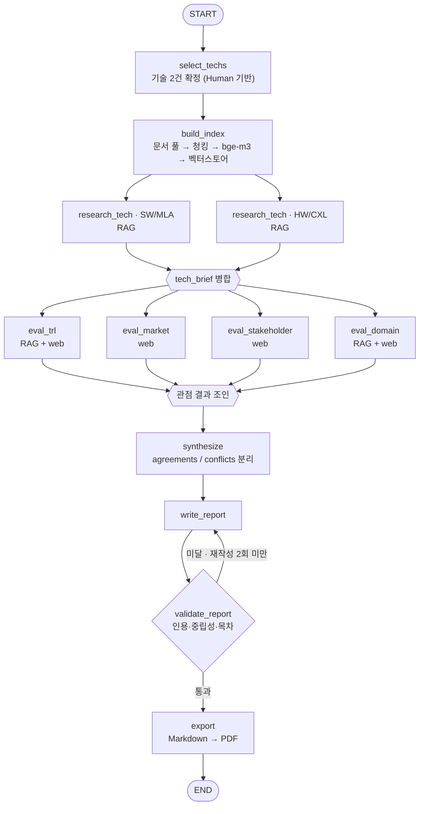

# KV cache 최적화 기술 다관점 평가 — 설계 산출물

SKALA / SK AX · Course AI · Activity 210 · `KV cache 최적화 기술 평가`
제출물 규격: `RAG-Design_{캠퍼스}-{X반}_{이름1+…+이름6}.pdf` · 반별 Slack thread · DAY 3 10:00

> 제출 전 채워야 할 값: **캠퍼스**(광주/울산/판교) · **반** · **조원 이름** ·
> 아래 ⚠️ 로 표시한 원문 실측값.

---

## 0. 이 설계가 잡은 축

활동 목적은 "어느 기술이 더 낫다"를 가리는 것이 아니라 **하나의 병목을 상반된 방식으로 푸는
두 기술이, 보는 관점에 따라 어떻게 다르게 평가받는지**를 드러내는 것이다. 그래서 설계의
모든 선택을 다음 세 원칙으로 고정했다.

1. **대칭성** — 두 기술에 같은 질의 템플릿·같은 근거 수집량·같은 출력 스키마를 쓴다.
   한쪽만 자료가 풍부해서 유리해 보이는 일을 구조로 막는다.
2. **근거 귀속** — 모든 주장에 출처가 붙지 않으면 보고서에 싣지 않는다. 검증 노드가 기계적으로 막는다.
3. **관점 분리** — 4개 관점의 결과를 State의 **서로 다른 키**에 담고, 상충을 지우지 않고
   `conflicts` 로 명시 보존한다. 종합 노드는 평균이 아니라 대조를 만든다.

---

## 1. 대상 기술 (선정 사유 포함)

### 1.1 선정 결과

| 진영 | 평가 단위 | 1차 근거 원문 | 접근의 성격 |
|---|---|---|---|
| **SW — 데이터를 작게 만들자** | **MLA (Multi-head Latent Attention)** | DeepSeek-V2: A Strong, Economical, and Efficient MoE Language Model (2024-06) | 어텐션 구조 자체를 재설계해 KV를 저차원 잠재공간으로 압축 |
| **HW — 담을 공간을 넓히자** | **CXL 기반 계층적 메모리 확장** | ITME: Inference Tiered Memory Expansion with Disaggregated CXL-Hybrid Memories (2026-06) | 원본 KV를 그대로 두고 HBM 밖 메모리 계층으로 확장 |

**평가 단위는 논문 1편이 아니라 "기술 접근"이다.** 원문은 기술 개요·한계의 1차 근거로만 쓰고,
시장·이해관계자 근거는 해당 접근을 둘러싼 생태계(모델·서빙 프레임워크 / 메모리 업계·표준화 단체)에서
찾는다. 이 구분이 없으면 2026-06 발표 논문의 시장 자료가 없다는 이유로 HW 진영 평가가 통째로 비게 된다.

### 1.2 선정 사유

**① 주제문의 대립을 가장 순수하게 구현한 쌍이다.**
MLA 는 모델을 바꿔 원본을 줄이고(정확도 리스크 O, 재학습 필요, 기존 HW 그대로),
CXL 확장은 원본을 건드리지 않고 담을 곳을 넓힌다(정확도 손실 X, 신규 인프라 필요).
"무엇을 포기하고 무엇을 얻는가"가 정반대라 관점별 평가가 실제로 엇갈린다.

**② TRL 위치가 다르다 → 성숙도 관점이 유효한 축이 된다.**
MLA 는 이미 공개 모델과 서빙 스택에 반영된 반면, CXL 계층 확장은 실증·초기 제품 구간으로 보인다.
두 기술이 같은 TRL 에 있으면 성숙도 관점이 아무것도 구분하지 못한다. (구체 단계는 §3.1 기준으로 산정)

**③ 이해관계자 집합이 겹치지 않는다.**
MLA 는 모델 제공자·서빙 프레임워크·추론 서비스 사업자가, CXL 은 메모리 반도체·서버 OEM·
표준화 컨소시엄·투자 업계가 이야기한다. 같은 병목을 두고 **서로 다른 산업이 서로 다른 언어로
말하는 상황**이 만들어져, 이해관계자 관점이 다른 관점과 중복되지 않는다.

**④ 배타적이지 않다는 점까지 결론에 쓸 수 있다.**
강의 자료가 지적한 "작게 만들면 넓은 공간으로 옮기기 쉬워진다"는 상호보완성을, 두 기술을
붙여 놓았을 때 비로소 시사점으로 쓸 수 있다.

### 1.3 기각한 후보와 사유

| 후보 | 진영 | 기각 사유 |
|---|---|---|
| TurboQuant (2025-04) | SW | 사후 양자화 계열은 KIVI·KVTC 등 후보가 난립해 "SW 진영 대표"로 놓기 어렵다. 반면 MLA 는 진영 논리(구조를 바꿔 애초에 작게)를 단일 기술로 대표한다. 연구 단계 결과라 시장·이해관계자 근거가 얇을 위험도 있어 선정 전 사전 확인이 필요했다 |
| KIVI (2024-06) | SW | 양자화 계열 **베이스라인** 성격. 평가 대상보다 MLA 의 압축률·정확도를 상대화하는 비교 기준으로 인용하는 쪽이 쓰임새가 크다 |
| InfiniGen (2024-06) | HW | 호스트 DRAM 오프로딩을 **기존 HW 위 SW 스케줄링**으로 푼다. 진영 구분이 흐려져 "SW vs HW" 대비가 약해진다. 단, CXL 이 대체하려는 기존 방식의 기준선으로 인용한다 |
| PIM/CXL (2025-10) | HW | 가장 순수한 HW 접근이나 DIMM-PIM 은 양산 채택 정보가 더 제한적이다. **ITME 대신 쓸 수 있는 1순위 대안**으로 남긴다 |

> ⚠️ 위 표의 수치·연도는 강의 자료 Doc Pool 표기를 옮긴 것이다. 원문 확보 후 대조한다.

---

## 2. B. 설계

### 2.1 기술 선정 방식 — **(2안) Human 기반**

조가 직접 선정하고 사유를 §1.2 에 명시하는 방식을 택했다.

- 선정은 전체 파이프라인에서 **딱 한 번 일어나고 결과가 6개 에이전트 전부의 입력을 결정**한다.
  여기서 LLM 이 흔들리면 이후 모든 산출이 흔들리는데, 1.5일 일정에서 되돌릴 여유가 없다.
- 문서 풀 **200페이지 한정**은 선정이 확정돼야 배분할 수 있다. 에이전트가 매 실행마다 다른
  기술을 고르면 인덱스를 다시 만들어야 한다.
- 재현성 — 같은 입력에 같은 보고서가 나와야 채점자가 검증할 수 있다.

> **(1안) 에이전트 기반을 완전히 버리지는 않는다.** 후보 6건을 기술 조사 에이전트가
> "관점별 근거 확보 가능성" 으로 사전 스코어링한 기록을 보고서 *기술 선정* 장에 부록으로 싣는다.
> 최종 확정은 사람이 한다 (= 선정 방식은 2안).

### 2.2 RAG 적용 대상

가이드 표에서 RAG 여부가 `O` 인 3개 중 **2개에 실제 적용**한다 (최소 1개 요건 충족).

| 에이전트 | 가이드 | 본 설계 | 사유 |
|---|---|---|---|
| 🔍 기술 조사 | O | **RAG ✅** | 기술 개요·범위·한계는 원문에만 있다. 필수 적용 대상 |
| 🏭 도메인 평가 | O | **RAG ✅** | 논문의 실험 환경·평가 섹션이 데이터센터 조건(배치 크기, 동시성, 비용)의 1차 근거다 |
| 📊 시장 평가 | O | **웹 검색 (RAG ✕)** | 논문에는 시장 규모·채택 현황이 없다. 문서 풀에 RAG 를 걸면 "근거 없음"만 반복 생성된다 |
| 🤝 이해관계자 평가 | X | 웹 검색 | 가이드와 동일 |
| 🏅 기술 성숙도(TRL) | (표에 없음) | 혼합 | 원문 = 실증 수준 근거(RAG), 웹 = 채택·양산 근거 |
| ⚖️ 평가 종합 | X | 없음 | State 입력만 사용 |
| 📝 보고서 생성 | X | 없음 | State 입력만 사용 |
| ✅ 보고서 검증 | (신규) | 없음 | 인용·중립성·형식 규칙 검사 |

**문서 풀 (200페이지 한정)**

| 순위 | 문서 | 용도 | 페이지 |
|---|---|---|---|
| 1 | DeepSeek-V2 (MLA) | SW 기술 원문 | ⚠️ 실측 |
| 2 | ITME (CXL-Hybrid) | HW 기술 원문 | ⚠️ 실측 |
| 3 | KIVI | SW 베이스라인 대조 | ⚠️ 실측 |
| 4 | InfiniGen | HW 기존 방식 기준선 | ⚠️ 실측 |

1·2번이 필수, 합계가 200p 에 닿을 때까지 3·4번을 순서대로 넣는다.
⚠️ **arXiv 접근이 막힌 환경에서 작성해 페이지 수를 실측하지 못했다.** PDF 확보 직후 합계를 확정한다.

### 2.3 Embedding 모델 — **BAAI/bge-m3**

선정 기준을 먼저 세우고 후보를 재었다.

1. **교차언어 검색** — 원문은 영어, 질의·보고서는 한국어다. 한영 교차 검색이 되어야 한다.
2. **긴 컨텍스트** — 논문 청크는 표·수식·캡션이 한 덩어리다. 512 토큰에서 잘리면 근거가 반토막 난다.
3. **비용** — 로컬 CPU/단일 GPU 로 200p 인덱싱이 1.5일 안에 끝나야 한다.
4. **라이선스** — 오픈소스 필수(활동 요건).

| 후보 | 최대 길이 | 다국어 | 라이선스 | 판정 |
|---|---|---|---|---|
| **BAAI/bge-m3** | 8192 | 100+ | MIT | **선정** |
| nlpai-lab/KURE-v1 | 8192 | 한국어 특화 | MIT | 차선 |
| intfloat/multilingual-e5-large | 512 | 100 | MIT | 기각 |
| sentence-transformers/all-MiniLM-L6-v2 | 256~512 | 영어 | Apache-2.0 | 기각 |

**bge-m3 선정 사유** — 8192 토큰으로 논문 섹션을 자르지 않고 담고, 한 모델이 dense·sparse 표현을
동시에 내어 **별도 BM25 인덱스 없이 하이브리드 검색**이 된다. 검색기가 하나로 줄어드는 만큼
1.5일 일정에서 장애 지점도 하나 줄어든다.
**KURE-v1 을 차선으로 둔 이유** — bge-m3 기반이라 컨텍스트 길이가 같고 한국어 질의에 강하지만,
본 과제의 코퍼스는 영어 원문이라 이점이 상쇄된다. 한국어 질의 재현율이 낮게 나오면 교체한다.
**기각** — e5-large 는 512 토큰 한계가 기준 2에 정면으로 걸리고, MiniLM 은 다국어가 아니다.

> 모델 카드 수치는 공개 스펙 기준이다. 인덱싱 직전 실제 모델 카드로 재확인한다.

### 2.4 검색·인용 설계 (중립성 장치)

- **청킹** — 섹션 경계 우선, 1,000토큰 / 150토큰 오버랩. 표·그림 캡션은 분리하지 않는다.
- **하이브리드 검색** — dense + sparse, top-k 8.
- **균형 검색** — 관점 질의를 *긍정 근거 / 한계·반론* 쌍으로 발행하고, 양쪽에서 **각각 최소 2건**을
  수집하지 못하면 해당 항목을 "근거 부족"으로 표기한다. 확증편향 방지의 핵심 장치다.
- **인용 강제** — 모든 문장은 `doc_id + page/chunk_id` 를 달고 State 에 들어간다. 없으면 검증 노드가 반려한다.
- **금지 어휘** — "우수하다 / 더 낫다 / 승자" 등 우열 표현을 검증 노드가 정규식으로 잡는다.

---

## 3. C. 평가 관점 및 기준

**선정 도메인: 데이터센터 · 클라우드 서빙** (대규모, 비용 민감, 멀티테넌시)

선정 사유 — 두 기술 모두의 1차 타깃이고 공개 자료가 가장 두껍다.
*온디바이스 AI* 는 CXL 계층 확장이 애초에 적용 대상이 아니라 한쪽이 "해당 없음"이 되어 비교가 성립하지 않고,
*장문맥 애플리케이션* 은 두 기술 모두 유리하다고만 나와 관점이 갈리지 않는다. 두 도메인은 시사점 장에서 보조로만 언급한다.

### 3.1 관점 ① 기술 성숙도 — TRL 기반

| 평가 대상 | 기준 (공개 정보 → TRL 추정) |
|---|---|
| 각 기술의 현재 단계 | 논문·특허만 존재 → **1~3** / 참조 구현 + 벤치마크 재현 → **4** / 유사 환경 통합·서드파티 프레임워크 통합 → **5~6** / 실운영 환경 시연·고객 샘플 공급 → **7~8** / 상용 양산·납품 → **9** |
| 근거 유형 | 논문, 학회 발표, 특허 출원, 오픈소스 저장소, 제품 출시 공지, 실적 공시 |
| 필수 표기 | **공개 정보 기반 추정**임을 단계마다 명시 |

**TRL 4~6 구간은 자료가 비어 있는 게 정상이다** (수율·공정 파라미터·실성능이 영업 비밀).
근거가 없을 때 "낮은 단계"로 내리지 않고 **`추정 불가`** 로 남긴다 — 이 처리가 두 기술의 비대칭을 만드는
가장 큰 함정이다. 또한 KV cache 기술은 **논문 발표와 실제 채택 사이에 시차**가 있어, 최신 논문일수록
TRL 이 낮게 보이는 편향이 있다. 보고서 한계점 장에 그대로 적는다.

### 3.2 관점 ② 시장성

| 평가 대상 | 기준 | 근거 소스 |
|---|---|---|
| 시장 규모·성장성 | 관련 시장 추정치와 성장률, 추정 주체·기준연도 병기 | 시장 리포트, 산업 뉴스 |
| 상용화·채택 현황 | 실제 도입 사례 건수, 제품 출시 발표 | 벤더 공지, 기술 블로그 |
| 생태계 지지 | 지원 프레임워크 수, 표준화 동향, 오픈소스 활동 | 표준화 단체, 저장소 |

### 3.3 관점 ③ 이해관계자

| 평가 대상 | 기준 | 근거 소스 |
|---|---|---|
| 경쟁 기술 진영 | 반대 진영의 반응, 대응 기술 발표 | 경쟁사 발표, 기술 블로그 |
| 도입 기업·개발자 | 도입 의견, 채택 장벽(재학습 비용/인프라 교체 비용) | 커뮤니티, 이슈 트래커, 인터뷰 |
| 투자 업계 | 투자 동향, 애널리스트·미디어 평가 | 투자 리포트, 미디어 |

### 3.4 관점 ④ 도메인 적용 — 데이터센터·클라우드

| 평가 대상 | 기준 |
|---|---|
| 비용 구조 | HBM 절감분 vs 신규 인프라·재학습 투자 |
| 멀티테넌시 | 한 사용자의 KV 가 다른 사용자 몫 메모리를 잠식하는 정도 |
| 지연·SLA | 압축/복원 오버헤드 vs 계층 간 전송 지연 (TTFT·TPOT 영향) |
| 운영 복잡도 | 기존 서빙 스택 변경 범위, 모델 교체 필요 여부 |
| 정확도 | 손실 여부와 허용 범위 |

### 3.5 종합

1~4번 관점의 결론을 **일치(agreements) / 상충(conflicts)** 두 묶음으로 분리해 기록한다.
상충은 해소하지 않는다 — `{관점A 주장, 관점B 주장, 각각의 근거, 왜 갈리는지}` 4요소를 보존한다.
보고서 *시사점* 장은 이 conflicts 목록으로 쓴다.

---

## 4. D. 그래프 설계(안)

### 4.1 State 설계

병렬 fan-out 구간에서 4개 관점 에이전트가 거의 동시에 State 를 갱신한다.
**관점별 결과를 각각 다른 키로 분리**해 동시 갱신 충돌을 원천 차단하고,
여러 노드가 함께 쓰는 키에만 리듀서를 단다.

| 키 | 타입 | 리듀서 | 생산 노드 | 소비 노드 | 비고 |
|---|---|---|---|---|---|
| `topic` | `str` | 기본 | 입력 | 전체 | 고정 |
| `domain` | `str` | 기본 | 입력 | 도메인·종합 | `datacenter` |
| `techs` | `list[TechSpec]` | 기본 | `select_techs` | 전체 | 2건 고정 (id, camp, 원문, 선정사유) |
| `corpus` | `CorpusMeta` | 기본 | `build_index` | RAG 노드 | 문서 수, 페이지 합계, 청크 수 |
| `tech_brief` | `dict[tech_id, TechBrief]` | `merge_by_key` | `research_tech` | 평가 4종 | 기술별 병렬 → **tech_id 로 분리** |
| `view_trl` | `dict[tech_id, ViewResult]` | 기본 | `eval_trl` | 종합 | **관점 전용 키** |
| `view_market` | `dict[tech_id, ViewResult]` | 기본 | `eval_market` | 종합 | **관점 전용 키** |
| `view_stakeholder` | `dict[tech_id, ViewResult]` | 기본 | `eval_stakeholder` | 종합 | **관점 전용 키** |
| `view_domain` | `dict[tech_id, ViewResult]` | 기본 | `eval_domain` | 종합 | **관점 전용 키** |
| `synthesis` | `Synthesis` | 기본 | `synthesize` | 보고서 | `agreements[] / conflicts[]` |
| `report_md` | `str` | 기본 | `write_report` | 검증·출력 | |
| `review` | `ReviewResult` | 기본 | `validate_report` | 조건 분기 | 미인용 문장, 금지어, 누락 장 |
| `revision` | `int` | `operator.add` | `validate_report` | 조건 분기 | 재작성 **최대 2회** |
| `references` | `list[Reference]` | `add_unique` | 근거 수집 노드 전부 | REFERENCE 장 | **병렬 동시 append → URL 기준 중복 제거** |
| `errors` | `list[str]` | `operator.add` | 전체 | 로그 | 노드 실패를 삼키지 않고 누적 |

`ViewResult` 공통 스키마 — `{verdict, evidences[{claim, source_id, url, stance}], confidence, unknown[]}`.
네 관점이 같은 스키마를 쓰기 때문에 종합 노드가 관점 간 대조를 형식적으로 수행할 수 있다.

### 4.2 Graph 흐름

**흐름 설명** — 정보 수집(`research_tech`) → 분석(관점 4종) → 평가(`synthesize`) → 보고서 순의
순차 골격 위에, 독립적인 두 구간만 병렬로 편다.

1. **기술별 fan-out** (`research_tech`) — 두 기술을 같은 프롬프트로 동시에 조사한다. 대칭성 원칙을 구조로 보장한다.
2. **관점별 fan-out** (평가 4종) — 서로를 참조하지 않아야 관점 독립성이 유지된다.
   한 관점이 다른 관점의 결론을 보면 의견이 수렴해 버려 "관점에 따라 갈린다"가 사라진다.
3. **검증 루프** — `validate_report` 는 LLM 판단이 아니라 규칙(미인용 문장 0건, 금지 어휘 0건,
   SUMMARY·REFERENCE 존재, SUMMARY ½페이지 이내)으로 판정한다. 실패 시 지적 사항을 붙여 재작성하되
   **2회로 끊는다** — 무한 루프는 1.5일 일정에서 가장 비싼 실패다.

---

## 5. E. 평가 보고서 목차(초안)

맨 앞 `SUMMARY`, 맨 뒤 `REFERENCE` 고정.

| # | 장 | 내용 | 분량 |
|---|---|---|---|
| 1 | **SUMMARY** | 관점별로 평가가 갈린 지점 위주의 핵심 요약. 개요가 아니다 | **½페이지 이내** |
| 2 | 분석 배경 | KV cache 가 연산 병목을 메모리 병목으로 바꾼 구조, 두 진영의 접근이 갈린 이유 | 1p |
| 3 | 기술 선정 | 선정한 2건과 사유, 기각 후보와 사유, (부록) 에이전트 사전 스코어링 | 1p |
| 4 | 기술 개요 | 4.1 MLA — 접근·효과·한계 / 4.2 CXL 계층 확장 — 접근·효과·한계 | 2p |
| 5 | 관점별 평가 | 5.1 기술 성숙도(TRL) / 5.2 시장성 / 5.3 이해관계자 / 5.4 도메인(데이터센터·클라우드) | 4p |
| 6 | 시사점 | `conflicts` 기반. 관점이 엇갈리는 지점과 그 이유 | 1~2p |
| 7 | 한계점 | 공개 정보 추정의 한계, TRL 4~6 정보 공백, 논문–채택 시차, 확증편향 방지 조치(균형 검색·인용 강제·금지 어휘) | 1p |
| 8 | **REFERENCE** | 실제 활용한 자료만 | — |

**REFERENCE 표기 형식**

- 특허 — 출원인(YYYY-MM). 특허명, 특허번호/공개번호, URL
- 논문 — 저자(YYYY). 논문제목. 학술지/학회명, 권(호), 페이지.
- 기타(웹) — 기관명 또는 작성자(YYYY-MM-DD). 제목. 사이트명, URL

`references` State 키에 수집 시점부터 이 형식으로 적재하고, 보고서에 인용되지 않은 항목은
출력 단계에서 제거한다 ("실제로 활용한 자료 목록만" 요건).

---

## 6. 미확정 항목

| 항목 | 상태 |
|---|---|
| 캠퍼스 · 반 · 조원 6인 이름 | 제출 파일명에 필요 — **미정** |
| 문서 풀 페이지 수 합계(200p 한정) | ⚠️ arXiv 접근 차단 환경이라 실측 못 함 |
| 원문 arXiv ID / 정확한 서지 | ⚠️ 동일 사유로 대조 못 함. Doc Pool 링크에서 채울 것 |
| §1.1 의 수치(93.3% 등) | 강의 자료 표기를 옮긴 값. 원문 대조 후 확정 |
| HW 기술 최종 확정 | ITME(CXL) 기준으로 작성. PIM/CXL 로 교체 시 §1.1·§1.3·§2.2 만 수정하면 나머지 설계는 그대로 유효 |
