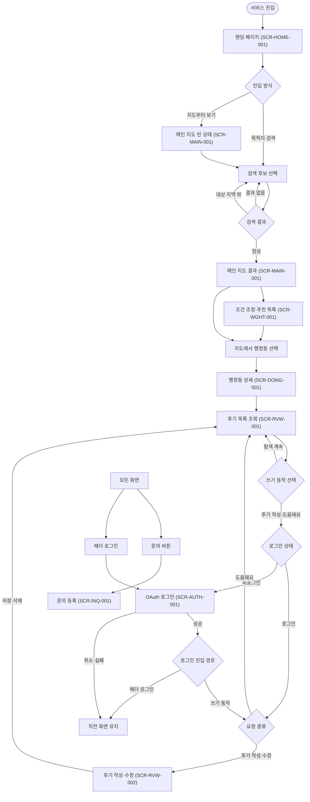

# 화면 설계서 — I Don't Know Seoul

서비스의 화면 구성, 사용자 흐름, UI 동작, 예외 처리와 API 연계를 정의한다.

| 항목 | 내용 |
|---|---|
| 프로젝트명 | I Don't Know Seoul |
| 작성자 | 판교_7반_P211_김기현 |
| 작성일 | 2026-09-16 |
| 버전 | v2.4 |
| 화면 수 | 총 8개 화면 (데스크톱 1440×900, 지도와 사이드바로 구성된 SPA) |

---

## 1. 화면 목록

| # | 화면 ID | 화면명 | 카테고리 | 경로 | 관련 요구사항 ID |
|---|---|---|---|---|---|
| 1 | `SCR-HOME-001` | 랜딩 페이지 | 탐색 | 진입 | REQ-FUNC-001, REQ-FUNC-002, REQ-FUNC-011, REQ-FUNC-016 |
| 2 | `SCR-MAIN-001` | 메인 지도 | 탐색 | 진입 > 지도 | REQ-FUNC-004, REQ-FUNC-005, REQ-FUNC-010, REQ-NFN-001 |
| 3 | `SCR-WGHT-001` | 목적지·조건 설정 | 탐색 | 메인 > 사이드바 > 조건·추천 | REQ-FUNC-002, REQ-FUNC-003, REQ-FUNC-006, REQ-FUNC-010, REQ-NFN-002 |
| 4 | `SCR-DONG-001` | 행정동 상세 | 등급 근거 | 메인 > 사이드바 > 상세 정보 | REQ-FUNC-007, REQ-FUNC-008, REQ-FUNC-009, REQ-NFN-006 |
| 5 | `SCR-AUTH-001` | OAuth 로그인 | 인증 | 전역 > 로그인 | REQ-FUNC-011, REQ-NFN-003, REQ-NFN-004 |
| 6 | `SCR-RVW-001` | 행정동 후기 목록 | 후기 | 메인 > 사이드바 > 사용자 후기 | REQ-FUNC-012, REQ-FUNC-013, REQ-FUNC-015 |
| 7 | `SCR-RVW-002` | 후기 작성·수정 | 후기 | 사용자 후기 > 작성 | REQ-FUNC-013, REQ-FUNC-014 |
| 8 | `SCR-INQ-001` | 문의 등록 | 문의 | 전역 > 문의 | REQ-FUNC-016 |

---

## 2. 전체 사용자 흐름



---

## 3. 공통 예외 처리 및 정책

모든 화면에 공통으로 적용한다. 각 화면의 ⑤에는 해당 화면에만 적용되는 예외만 작성한다.

| 상태 | 발생 조건 | 화면 처리 방식 | 코드 |
|---|---|---|---|
| 정상 | 입력값이 유효하고 요청이 성공함 | 다음 화면으로 이동하거나 목록 갱신 | 200 / 201 |
| 형식 오류 | 필수값 누락·형식 위반 | 필드 하단에 안내 문구 표시, 제출 버튼 비활성 | 400 |
| 미로그인 | 세션 없이 쓰기 API 호출 | `SCR-AUTH-001` 모달을 표시하고, 로그인 후 직전 동작을 이어서 수행 | 401 |
| 권한 없음 | 타인의 리소스에 쓰기 시도 | 요청 거부 | 403 |
| 리소스 없음 | 삭제되었거나 존재하지 않는 대상 | 안내 후 이전 화면 또는 목록으로 복귀 | 404 |
| 충돌 | 후기·도움돼요 등 중복 데이터가 이미 존재함 | 오류 안내 또는 버튼 상태 동기화 | 409 |
| 빈 상태 | 조회 결과가 0건 | 안내 문구와 다음 행동 제시 | — |
| 로딩 | 응답을 기다리는 중 | 스피너 표시, 버튼 비활성화로 중복 클릭 방지 | — |
| 서버 오류 | 서버 내부 예외 | `잠시 후 다시 시도해 주세요.` 안내 | 500 |

### 3.1 공통 입력 유효성 규칙

| 항목 | 규칙 | 위반 시 문구 |
|---|---|---|
| 목적지 | 최대 3곳, 대상 지역 내 좌표만 | `목적지는 최대 3곳까지 추가할 수 있습니다.` / `대상 지역을 벗어난 목적지입니다.` |
| 가중치 | 치안·가격·생활편의 합계 100 | 세 가중치의 합이 항상 100이 되도록 자동 조정 |
| 후기 본문 | 20자 이상 1000자 이하 | `본문은 20자 이상 입력해 주세요` |
| 후기 평점 | 치안·가격·생활편의 1~5, 3항목 모두 필수 | `항목별 평점을 선택해 주세요` |
| 문의 내용 | 10자 이상 1000자 이하 | `문의 내용을 10자 이상 입력해 주세요` |

---

## 4. 공통 레이아웃

```text
┌──────────────────────────── 지도 1fr ────────────────────────────┬── 사이드바 380px ──────┐
│ [✓ 지하철 노선도] [노선 ▸]                              [+][-]  │ I Don't Know Seoul       │
│                                                                  │ [로그인]                 │
│ 행정동 등급 폴리곤 + 지하철 노선 + 목적지/선택 행정동 표시       │ [ 목적지 검색          ] │
│                                                                  │ [상세 정보][조건·추천][사용자 후기]│
│                                                                  │ 탭별 스크롤 콘텐츠        │
│ [지도 출처·저작권]                                               │ 데이터 기준·주의문구      │
└──────────────────────────────────────────────────────────────────┴─────────────────────────┘
                                                                                [문의]
```

사이드바는 `상세 정보`(`SCR-DONG-001`), `조건·추천`(`SCR-WGHT-001`), `사용자 후기`(`SCR-RVW-001`) 탭으로 구성한다. 행정동을 선택하지 않았으면 `상세 정보`와 `사용자 후기` 탭을 비활성화하고 `조건·추천` 탭을 기본으로 연다.

---

## 5. 화면별 상세 설계

---

### 5.1 `SCR-HOME-001`  랜딩 페이지                                                            탐색 · 1/8

**① 기본 정보**

| 항목 | 내용 |
|---|---|
| 화면 ID | `SCR-HOME-001` |
| 화면명 | 랜딩 페이지 |
| 경로(Depth) | 진입 |
| 화면 유형 | 앱 전체 화면 |
| 관련 요구사항 | `REQ-FUNC-001`, `REQ-FUNC-002`, `REQ-FUNC-011`, `REQ-FUNC-016` |
| 주요 API | `GET /api/places` |

**② 화면 와이어프레임**

```text
┌──────────────────────────────────────────────────────────────────────────────┐
│ I Don't Know Seoul                                      ①[로그인] │
│                                                                              │
│                         ● Best  ● Normal  ● Bad                              │
│                                                                              │
│                       어디에 살아야 할지 모르겠다면                          │
│              회사나 학교를 검색하면, 서울과 인접 경기의                     │
│                  거주 후보 지역을 한눈에 비교합니다.                         │
│                                                                              │
│              [ ② 회사나 학교를 검색하세요 (예: 강남역, SK AX) ]             │
│                       ④ 목적지 없이 지도부터 볼게요                          │
│                    서버에 아무것도 저장하지 않습니다                         │
│                                                                              │
│                                                       [⑤ 문의]               │
└──────────────────────────────────────────────────────────────────────────────┘
```

데스크톱 1440×900 프레임을 기준으로 설계한다. 등급 지도를 배경으로 배치하고, 화면 중앙에 목적지 검색 행동을 둔다. 와이어프레임의 번호는 아래 상세 설명 표와 1:1로 연결된다.

**③ 사용자 흐름**

> ② 목적지 검색 → 후보 목록 표시

> **성공** → ③ 검색 후보를 선택하면 `SCR-MAIN-001`의 결과 상태로 이동하고, 선택한 목적지를 `SCR-WGHT-001`에 반영한다.

> ④ 목적지 없이 지도부터 보기를 클릭하면 `SCR-MAIN-001` 빈 상태로 이동한다.

**④ 상세 설명**

| NO | UI 요소명 | 관련 요구사항 ID | 상세 동작 및 로직 | 호출 API | 이동 |
|---|---|---|---|---|---|
| ① | 로그인 버튼 | `REQ-FUNC-011` | 클릭 시 로그인 모달을 현재 화면 위에 띄운다 | — | `SCR-AUTH-001` |
| ② | 목적지 검색 | `REQ-FUNC-002` | 2자 이상 입력하면 장소명·주소·좌표가 포함된 후보를 표시한다 | `GET /api/places` | — |
| ③ | 검색 후보 | `REQ-FUNC-002` | 선택한 목적지를 URL과 화면 상태에 반영한다 | — | `SCR-MAIN-001` |
| ④ | 지도부터 보기 | `REQ-FUNC-001` | 목적지 없이 메인 지도 화면으로 진입한다 | — | `SCR-MAIN-001` (빈 상태) |
| ⑤ | 문의 버튼 | `REQ-FUNC-016` | 문의 패널을 오버레이한다 | — | `SCR-INQ-001` |

**⑤ 예외 처리 및 정책**

| 상태 | 발생 조건 | 처리 방식 | 코드 |
|---|---|---|---|
| 검색 결과 없음 | 검색 결과 0건 | 검색창 아래에 결과 없음 안내 | 404 |
| 서버 오류 | 장소 검색 실패 | `잠시 후 다시 시도해 주세요.` | 500 |

---

### 5.2 `SCR-MAIN-001`  메인 지도                                                               탐색 · 2/8

**① 기본 정보**

| 항목 | 내용 |
|---|---|
| 화면 ID | `SCR-MAIN-001` |
| 화면명 | 메인 지도 |
| 경로(Depth) | 진입 > 지도 |
| 화면 유형 | 지도 전체 화면(사이드바 병행) |
| 관련 요구사항 | `REQ-FUNC-004`, `REQ-FUNC-005`, `REQ-FUNC-010`, `REQ-NFN-001` |
| 주요 API | `GET /api/recommendations`, `GET /api/subway-network` |

**② 화면 와이어프레임 (빈 상태 — 목적지 0곳)**

```text
┌───────────────────────────────┬──────────────────────┐
│ [✓ 지하철 노선도] [노선 ▸]    │ I Don't Know Seoul   │
│                               │ [로그인]              │
│         수도권 지도           │ [ 목적지 검색      ] │
│       지하철 노선·역 표시     │                      │
│                               │ 먼저 목적지를 선택해 주세요.│
│                               │ 회사나 학교를 검색하면     │
│                               │ 통근 가능한 행정동을 계산  │
│                    [+][-]     │                      │
│ [출처]                        │ 데이터 기준 / 주의문구 │
└───────────────────────────────┴──────────────────────┘
```

**와이어프레임 (결과 상태 — 목적지 1곳 이상)**

```text
┌──────────────────────────────────────┬────────────────────────────┐
│ ① 행정동 등급 폴리곤                 │ (사이드바 = SCR-WGHT-001)  │
│  초록 Best / 노랑 Normal / 빨강 Bad  │                            │
│  ② 통근 상한 초과 행정동은 비활성(회색)│                            │
│ ③ 지도 표시 기준 [등급/통근시간]     │                            │
│ ④ 지하철 노선·역 / 목적지 펄스       │                            │
│  선택한 행정동 흰색 외곽선            │                            │
│ ⑤[✓ 지하철 노선도] [노선 ▾]          │                            │
│ ⑥[이 결과 링크 복사]                 │                            │
└──────────────────────────────────────┴────────────────────────────┘

노선 필터 펼침
┌────────────────────────────┐
│ ─ 1호선       ─ 2호선      │
│ ─ 3호선       ─ 4호선      │
│ ─ 5호선       ─ 6호선      │
│ ─ 7호선       ─ 8호선      │
│ ─ 9호선       ─ 신분당선   │
│ ─ 경의·중앙선 ─ 수인·분당선│
│ ─ GTX-A                    │
└────────────────────────────┘
```

**③ 사용자 흐름**

> ① 행정동 등급 폴리곤을 클릭하면 `SCR-DONG-001`으로 전환한다.

> ⑤ 노선 필터를 펼치면 노선별 표시·숨김을 설정할 수 있다(현재 화면 유지).

> ⑥ 결과 링크를 복사하면 클립보드에 저장하고, 링크에 접속했을 때 동일한 조건을 복원한다.

> ⚠ 목적지가 없으면 등급을 표시하지 않고 검색 안내만 노출한다(빈 상태).

**④ 상세 설명**

| NO | UI 요소명 | 관련 요구사항 ID | 상세 동작 및 로직 | 호출 API | 이동 |
|---|---|---|---|---|---|
| ① | 등급 폴리곤 | `REQ-FUNC-004` | 547개 행정동의 등급을 색상과 아이콘으로 표시하고, 클릭하면 상세 화면으로 이동한다 | `GET /api/recommendations` | `SCR-DONG-001` |
| ② | 통근권 밖 표시 | `REQ-FUNC-004` | API가 반환한 통근시간을 기준으로 통근 상한을 초과한 행정동을 추천에서 제외하고 지도에서 비활성화한다 | — | — |
| ③ | 지도 표시 기준 | `REQ-FUNC-004` | 등급 또는 통근시간으로 지도 표시 기준을 전환하고 범례도 함께 변경한다 | 폴리곤 색상 레이어 교체 | — |
| ④ | 지하철 노선도 | `REQ-FUNC-005` | 기본 상태에서는 전체 노선을 표시하고, 체크박스로 전체 표시 여부를 전환한다 | `GET /api/subway-network` | — |
| ⑤ | 노선 필터 | `REQ-FUNC-005` | 펼침 패널에서 노선별 표시 여부를 설정한다 | 클라이언트 레이어 필터 | — |
| ⑥ | 링크 복사 | `REQ-FUNC-010` | 현재 목적지·조건·선택한 행정동을 URL 쿼리로 직렬화한다 | Clipboard API | — |

**⑤ 예외 처리 및 정책**

| 상태 | 발생 조건 | 처리 방식 | 코드 |
|---|---|---|---|
| 빈 상태 | 목적지 0곳 | 등급을 표시하지 않고 검색 안내 노출 | — |
| 로딩 | 지도 번들을 불러오는 중 | 지도 스켈레톤 표시 | — |
| 서버 오류 | 데이터 로드 실패 | 전체 화면 오류 상태와 다시 시도 버튼 표시 | 500 |

---

### 5.3 `SCR-WGHT-001`  목적지·조건 설정                                                        탐색 · 3/8

**① 기본 정보**

| 항목 | 내용 |
|---|---|
| 화면 ID | `SCR-WGHT-001` |
| 화면명 | 목적지·조건 설정 |
| 경로(Depth) | 메인 > 사이드바 > 조건·추천 |
| 화면 유형 | 사이드바 탭 패널 |
| 관련 요구사항 | `REQ-FUNC-002`, `REQ-FUNC-003`, `REQ-FUNC-006`, `REQ-FUNC-010`, `REQ-NFN-002` |
| 주요 API | `GET /api/places`, `GET /api/recommendations` |

**② 화면 와이어프레임**

```text
                                   ┌────────────────────────────┐
                                   │ [로그인]                    │
                                   │ ① [ 목적지 검색          ] │
                                   │ ② 목적지 목록              │
                                   │ [강남역 지하철역        ×] │
                                   │ [판교역                 ×] │
                                   │ [+ 목적지 추가 (최대 3)   ] │
                                   ├────────────────────────────┤
                                   │ [상세 정보][조건·추천][사용자 후기]│
                                   ├────────────────────────────┤
                                   │ ③ 통근 상한 ───●─── 40분 │
                                   │ ④ 월세 예산 ───● 제한 없음│
                                   │ ⑤[✓ 단독·다가구][연립·다세대]│
                                   │   [오피스텔][아파트]       │
                                   │ ⑥[환산월세][순수월세]      │
                                   │ ⑦ 가중치(합계 100 자동 유지)│
                                   │ 치안 30 ──●──              │
                                   │ 가격 35 ───●─              │
                                   │ 생활편의 35 ───●─          │
                                   │ ⑧[기본값으로 복원]         │
                                   ├────────────────────────────┤
                                   │ ⑨ 추천 행정동 (상위 20)   │
                                   │ ⑩ 1 풍덕천2동·수지구·38분 │
                                   │      ●Best  종합 67.2      │
                                   │    2 상현1동 · 수지구 ·41분│
                                   │      ●Best  종합 65.8      │
                                   │    3 …                     │
                                   ├────────────────────────────┤
                                   │ ⑪[이 결과 링크 복사]       │
                                   └────────────────────────────┘
```

**③ 사용자 흐름**

> ① 목적지를 검색하고 후보를 선택하면 ② 목적지 목록에 추가한다.

> ③~⑧ 조건·가중치를 변경하면 **성공** 시 지도와 추천 목록을 즉시 재계산한다.

> ⑩ 추천 항목을 클릭하면 `SCR-DONG-001`으로 이동한다.

> ⑪ 결과 링크 복사를 클릭하면 현재 조건을 담은 URL을 클립보드에 복사한다.

> ⚠ 조건을 만족하는 행정동이 없으면 `조건에 맞는 지역이 없습니다. 통근 상한을 늘려 보세요.`를 표시한다.

**④ 상세 설명**

| NO | UI 요소명 | 관련 요구사항 ID | 상세 동작 및 로직 | 호출 API | 이동 |
|---|---|---|---|---|---|
| ① | 목적지 검색 | `REQ-FUNC-002` | 2자 이상 입력하면 장소명·주소·좌표가 포함된 후보를 표시한다 | `GET /api/places` | — |
| ② | 목적지 목록 | `REQ-FUNC-002` | 최대 3곳까지 추가·삭제할 수 있으며, 지도에서 역을 선택해 추가할 수도 있다 | — | — |
| ③ | 통근 상한 | `REQ-FUNC-003` | 기본값은 40분이며, 상한을 초과한 행정동은 추천 대상에서 제외한다 | `GET /api/recommendations` | — |
| ④ | 월세 예산 | `REQ-FUNC-003` | 제한 없음 또는 월세 상한값(만원)을 적용한다 | `GET /api/recommendations` | — |
| ⑤ | 주택 유형 | `REQ-FUNC-003` | 단독·다가구, 연립·다세대, 오피스텔, 아파트를 복수로 선택할 수 있다 | `GET /api/recommendations` | — |
| ⑥ | 월세 기준 | `REQ-FUNC-003` | 환산월세 또는 순수월세를 가격 점수 산정 기준으로 선택한다 | `GET /api/recommendations` | — |
| ⑦ | 가중치 | `REQ-FUNC-003` | 기본값은 치안 30·가격 35·생활편의 35이며, 합계가 100이 되도록 자동 보정한다 | `GET /api/recommendations` | — |
| ⑧ | 기본값 복원 | `REQ-FUNC-003` | 통근·가격·주택 유형·월세 기준·가중치를 기본값으로 되돌린다 | — | — |
| ⑨ | 추천 목록 | `REQ-FUNC-006` | 통근 상한을 만족하는 행정동 중 종합 점수가 높은 상위 20개를 표시한다 | `GET /api/recommendations?sort=score` | — |
| ⑩ | 목록 항목 | `REQ-FUNC-006` | 등급·자치구·통근시간·종합 점수를 표시하고, 마우스를 올리면 지도에서 해당 행정동을 강조한다 | `GET /api/regions/{code}` | `SCR-DONG-001` |
| ⑪ | 링크 복사 | `REQ-FUNC-010` | 목적지·조건·선택한 행정동을 URL 쿼리로 직렬화해 클립보드에 복사한다 | Clipboard API | — |

**⑤ 예외 처리 및 정책**

| 상태 | 발생 조건 | 처리 방식 | 코드 |
|---|---|---|---|
| 잘못된 입력 | 허용 범위 밖 값, 대상 지역 밖 좌표, 목적지 4곳째 추가 시도 | 슬라이더가 허용 범위를 넘지 않도록 제한하고 안내 문구를 표시한다 | 400 |
| 빈 상태 | 조건을 만족하는 행정동 0곳 | `조건에 맞는 지역이 없습니다. 통근 상한을 늘려 보세요.` | — |
| 빈 상태 | 목적지 0곳 | 추천 목록 대신 목적지 검색 안내를 표시한다 | — |

---

### 5.4 `SCR-DONG-001`  행정동 상세                                                        등급 근거 · 4/8

**① 기본 정보**

| 항목 | 내용 |
|---|---|
| 화면 ID | `SCR-DONG-001` |
| 화면명 | 행정동 상세 |
| 경로(Depth) | 메인 > 사이드바 > 상세 정보 |
| 화면 유형 | 사이드바 탭 패널 |
| 관련 요구사항 | `REQ-FUNC-007`, `REQ-FUNC-008`, `REQ-FUNC-009`, `REQ-NFN-006` |
| 주요 API | `GET /api/regions/{code}`, `GET /api/regions/{code}/commute?destinationIds={ids}` |

**② 화면 와이어프레임**

```text
┌──────────────────────────────────────┬────────────────────────────┐
│ 선택한 행정동 흰색 외곽선            │ [상세 정보][조건·추천][사용자 후기]│
│ 선택한 행정동 → 목적지 파란 점선 경로│ ① 용인시 수지구 풍덕천2동 ●Best│
│                                      │   수도권 547개 행정동 중 2위 │
│                                      │ ② 종합 점수      67.2 /100 │
│                                      │   치안 86  ━━━━━━━━━━━     │
│                                      │   가격 65  ━━━━━━━━        │
│                                      │   생활편의 43 ━━━━━        │
│                                      │ ③[▾ 계산 근거 전체 보기]   │
│                                      │   원지표·백분위·가중치·수식│
│                                      │ ④ 통근 경로 38분 / 환승 없음│
│                                      │   도보 12→대기 3→지하철 23 │
│                                      │ ⑤ 데이터 기준 시점·출처    │
└──────────────────────────────────────┴────────────────────────────┘
```

**③ 사용자 흐름**

> 지도 또는 추천 목록에서 행정동을 선택하면 이 화면으로 전환하고, ① 등급·순위와 ② 항목별 점수를 표시한다.

> ③ `계산 근거 전체 보기`를 펼치면 원지표 → 백분위 → 가중치 → 종합식 순으로 노출한다.

> `사용자 후기` 탭으로 전환하면 `SCR-RVW-001`으로 이동한다(후기 읽기는 로그인 불필요).

> ⚠ 존재하지 않는 행정동 코드로 접근하면 `지역 정보를 찾을 수 없습니다.`를 표시한다(404).

**④ 상세 설명**

| NO | UI 요소명 | 관련 요구사항 ID | 상세 동작 및 로직 | 호출 API | 이동 |
|---|---|---|---|---|---|
| ① | 행정동명·등급 | `REQ-FUNC-007` | 상대 등급과 전체 순위를 표시한다. 상위 30%는 Best, 중간 40%는 Normal, 하위 30%는 Bad로 구분한다 | `GET /api/regions/{code}` | — |
| ② | 항목별 점수 | `REQ-FUNC-007` | 치안·가격·생활편의 점수를 0~100으로 표시한다 | `GET /api/regions/{code}` | — |
| ③ | 계산 근거 | `REQ-FUNC-008` | 지표별 백분위·가중치·계산식을 접이식으로 노출 | `GET /api/regions/{code}` | — |
| ④ | 통근 경로 | `REQ-FUNC-009` | 목적지별 소요시간·승차역·하차역·환승 정보를 표시하고 지도에 점선으로 나타낸다 | `GET /api/regions/{code}/commute?destinationIds={ids}` | — |
| ⑤ | 출처 표기 | `REQ-NFN-006` | 지표별 출처와 기준 시점을 표시한다 | `GET /api/regions/{code}` | — |

**⑤ 예외 처리 및 정책**

| 상태 | 발생 조건 | 처리 방식 | 코드 |
|---|---|---|---|
| 리소스 없음 | 존재하지 않는 행정동 코드 | `지역 정보를 찾을 수 없습니다.` | 404 |
| 부분 결측 | 표본이 부족한 지표 | `표본 부족` 배지와 `데이터 없음` 표기 | — |
| 경로 없음 | 대중교통 경로 미탐색 | `대중교통 경로를 찾지 못했습니다.` | — |

---

### 5.5 `SCR-AUTH-001`  OAuth 로그인                                                            인증 · 5/8

**① 기본 정보**

| 항목 | 내용 |
|---|---|
| 화면 ID | `SCR-AUTH-001` |
| 화면명 | OAuth 로그인 |
| 경로(Depth) | 전역 > 로그인 |
| 화면 유형 | 모달 오버레이 |
| 관련 요구사항 | `REQ-FUNC-011`, `REQ-NFN-003`, `REQ-NFN-004` |
| 주요 API | `GET /api/auth/{provider}`, `GET /api/auth/{provider}/callback` |

**② 화면 와이어프레임**

```text
사이드바 헤더 (비로그인)                사이드바 헤더 (로그인 후)
┌────────────────────────────┐        ┌────────────────────────────┐
│ ①[로그인]                  │        │④ seoul_kim ▾                │
└──────┬─────────────────────┘        │   └ 로그아웃               │
       │ 클릭                          └────────────────────────────┘
       ▼
        ┌────────────────────────────────────────┐
        │ 로그인                           ⑤[×] │
        │ 후기를 작성하려면 로그인이 필요합니다.  │
        │ 후기 조회와 지역 탐색은 로그인 없이     │
        │ 이용할 수 있습니다.                     │
        ├────────────────────────────────────────┤
        │ ② [  카카오로 계속하기  ]               │
        │ ③ [  GitHub로 계속하기  ]               │
        ├────────────────────────────────────────┤
        │ 제공자 식별자와 닉네임만 저장합니다.     │
        └────────────────────────────────────────┘
```

**③ 사용자 흐름**

> ① 헤더 로그인 버튼을 클릭하거나 세션 없이 후기를 작성하려고 하면 이 모달을 표시한다.

> ②·③ 제공자를 선택하면 인가 화면으로 이동한 뒤 콜백을 처리한다.

> **성공** → 세션 발급 → 모달 닫힘 → 헤더가 닉네임으로 바뀌고 직전 동작을 이어서 수행

> ⑤ 닫기를 클릭하면 모달만 닫고 현재 화면 상태를 유지한다.

> ⚠ 인가 코드 누락·만료 → `로그인에 실패했습니다. 다시 시도해 주세요.` (400)

**④ 상세 설명**

| NO | UI 요소명 | 관련 요구사항 ID | 상세 동작 및 로직 | 호출 API | 이동 |
|---|---|---|---|---|---|
| ① | 헤더 로그인 버튼 | `REQ-FUNC-011` | 모달을 현재 화면 위에 띄운다. 지도·탭 상태는 유지 | — | — |
| ② | 카카오로 계속하기 | `REQ-FUNC-011` | 제공자 인가 화면으로 이동 (provider=kakao) | `GET /api/auth/{provider}` | 외부 인가 화면 |
| ③ | GitHub로 계속하기 | `REQ-FUNC-011` | 제공자 인가 화면으로 이동 (provider=github) | `GET /api/auth/{provider}` | 외부 인가 화면 |
| — | 콜백 처리 | `REQ-FUNC-011`, `REQ-NFN-003` | 인가 코드로 세션 발급. 제공자 토큰은 서버에만 둔다 | `GET /api/auth/{provider}/callback` | 직전 화면 복귀 |
| ④ | 헤더 닉네임·로그아웃 | `REQ-FUNC-011` | 로그인 상태 표시, 로그아웃해도 탐색·조회는 유지 | `GET /api/auth/me`, `POST /api/auth/logout` | — |
| ⑤ | 닫기 | `REQ-FUNC-011` | 모달만 닫고 원래 화면 상태 유지 | — | — |

**⑤ 예외 처리 및 정책**

| 상태 | 발생 조건 | 처리 방식 | 코드 |
|---|---|---|---|
| 형식 오류 | 인가 코드 누락·만료 | `로그인에 실패했습니다. 다시 시도해 주세요.` | 400 |
| 서버 오류 | 제공자 응답 실패 | `잠시 후 다시 시도해 주세요.` | 500 |

---

### 5.6 `SCR-RVW-001`  행정동 후기 목록                                                     후기 · 6/8

**① 기본 정보**

| 항목 | 내용 |
|---|---|
| 화면 ID | `SCR-RVW-001` |
| 화면명 | 행정동 후기 목록 |
| 경로(Depth) | 메인 > 사이드바 > 사용자 후기 |
| 화면 유형 | 사이드바 탭 패널 |
| 관련 요구사항 | `REQ-FUNC-012`, `REQ-FUNC-013`, `REQ-FUNC-015` |
| 주요 API | `GET /api/regions/{code}/reviews` |

**② 화면 와이어프레임**

```text
                                   ┌────────────────────────────┐
                                   │ [상세 정보][조건·추천][사용자 후기]│
                                   ├────────────────────────────┤
                                   │ ① 풍덕천2동 실거주 후기 12건│
                                   │ ②[현재 목적지 관련순 ▾]    │
                                   │   최신순 · 도움돼요순      │
                                   ├────────────────────────────┤
                                   │ ③ 닉네임 · 거주 1년 4개월  │
                                   │   판교역까지 38분(체감 45) │
                                   │   치안★★★★☆ 가격★★★☆☆  │
                                   │   생활편의★★★★☆          │
                                   │   "언덕이 심해서 겨울엔…"  │
                                   │ ④[👍 도움돼요 7]           │
                                   ├────────────────────────────┤
                                   │   … 20건 단위 페이징       │
                                   ├────────────────────────────┤
                                   │  ⑤[ + 후기 남기기 ]        │
                                   └────────────────────────────┘
```

**③ 사용자 흐름**

> ① 탭에 진입하면 선택한 행정동의 후기 목록을 불러온다.

> ② 정렬 기준을 변경하면 목록을 다시 불러온다(현재 목적지 관련순 / 최신순 / 도움돼요순).

> ④·⑤를 클릭했을 때 세션이 없으면 `SCR-AUTH-001`을 표시하고, 로그인 성공 후 원래 동작을 이어서 수행한다.

> ⑤ 해당 행정동에 이미 후기를 작성한 회원에게는 `내 후기 수정`을 표시하고 `SCR-RVW-002` 수정 모드로 이동한다.

> ⚠ 후기 0건이면 `아직 후기가 없습니다. 첫 후기를 남겨 주세요.`를 표시한다.

**④ 상세 설명**

| NO | UI 요소명 | 관련 요구사항 ID | 상세 동작 및 로직 | 호출 API | 이동 |
|---|---|---|---|---|---|
| ① | 탭 진입 | `REQ-FUNC-012` | 선택한 행정동의 후기 목록을 연다. 행정동을 선택하지 않으면 탭을 비활성화한다 | `GET /api/regions/{code}/reviews` | — |
| ② | 정렬 선택 | `REQ-FUNC-012` | 기본값은 `현재 목적지 관련순`이며, 최신순·도움돼요순으로 변경할 수 있다 | `GET /api/regions/{code}/reviews?sort={sort}` | — |
| ③ | 후기 카드 | `REQ-FUNC-012` | 닉네임·거주 기간·통근 목적지·체감 통근시간·항목별 평점·본문·도움돼요 수를 표시한다 | — | — |
| ④ | 도움돼요 | `REQ-FUNC-015` | 로그인한 회원은 후기별로 1회 등록할 수 있으며, 다시 클릭하면 취소된다 | `POST /api/reviews/{id}/helpful`, `DELETE /api/reviews/{id}/helpful` | `SCR-AUTH-001` (비로그인 시) |
| ⑤ | 후기 남기기 | `REQ-FUNC-013` | 로그인한 회원만 작성할 수 있다. 이미 후기를 작성한 경우 `내 후기 수정`으로 표시한다 | — | `SCR-RVW-002` |

**⑤ 예외 처리 및 정책**

| 상태 | 발생 조건 | 처리 방식 | 코드 |
|---|---|---|---|
| 리소스 없음 | 삭제된 후기에 반응 | `삭제된 후기입니다.` | 404 |
| 충돌 | 도움돼요를 중복 등록 | 버튼 상태만 동기화 | 409 |
| 빈 상태 | 후기 0건 | `아직 후기가 없습니다. 첫 후기를 남겨 주세요.` | — |

---

### 5.7 `SCR-RVW-002`  후기 작성·수정                                                      후기 · 7/8

**① 기본 정보**

| 항목 | 내용 |
|---|---|
| 화면 ID | `SCR-RVW-002` |
| 화면명 | 후기 작성·수정 |
| 경로(Depth) | 사용자 후기 > 작성 |
| 화면 유형 | 모달 오버레이 |
| 관련 요구사항 | `REQ-FUNC-013`, `REQ-FUNC-014` |
| 주요 API | `POST /api/regions/{code}/reviews`, `PATCH /api/reviews/{id}` |

**② 화면 와이어프레임**

```text
                ┌────────────────────────────────┐
                │ 풍덕천2동 후기 남기기       [×] │
                ├────────────────────────────────┤
                │ ① 거주 기간   [ 1년 4개월  ▾ ] │
                │ ② 통근 목적지 [ 판교역     ▾ ] │
                │ ③ 체감 통근   [ 45 ] 분        │
                │ ④ 치안★★★★☆ 가격★★★☆☆       │
                │    생활편의★★★★☆              │
                │ ⑤ ┌──────────────────────────┐ │
                │    │ 20자 이상 입력하세요…    │ │
                │    └──────────────────────────┘ │
                │      ⑦[삭제]      ⑥[저장]     │
                └────────────────────────────────┘
```

**③ 사용자 흐름**

> ①~⑤를 입력한 뒤 ⑥ 저장을 클릭한다.

> **성공** → 신규는 201, 수정은 200을 반환하고 `SCR-RVW-001` 목록 최상단에 반영한다.

> 수정 모드에서 ⑦ 삭제를 클릭하면 확인 후 삭제하고 `SCR-RVW-001` 목록에서 제거한다.

> ⚠ 해당 행정동에 이미 후기가 있으면 `이미 이 행정동에 후기를 작성하셨습니다. 수정하시겠어요?`를 표시한다(409).

> ⚠ 본문이 20자 미만이거나 평점을 선택하지 않으면 필드 하단에 오류 문구를 표시하고 저장을 비활성화한다(400).

**④ 상세 설명**

| NO | UI 요소명 | 관련 요구사항 ID | 상세 동작 및 로직 | 호출 API | 이동 |
|---|---|---|---|---|---|
| ① | 거주 기간 | `REQ-FUNC-013` | 개월 수, 필수, 1~600 | — | — |
| ② | 통근 목적지 | `REQ-FUNC-013` | 설정한 목적지 중 하나를 선택하거나 직접 검색한다. 후기의 목적지 관련순 정렬 기준으로 사용한다 | `GET /api/places` | — |
| ③ | 체감 통근시간 | `REQ-FUNC-013` | 선택 입력, 0~240분 | — | — |
| ④ | 항목별 평점 | `REQ-FUNC-013` | 치안·가격·생활편의 각 1~5, 필수 | — | — |
| ⑤ | 본문 | `REQ-FUNC-013` | 20자 이상 1000자 이하 | — | — |
| ⑥ | 저장 | `REQ-FUNC-013`, `REQ-FUNC-014` | 신규는 POST, 수정은 PATCH | `POST /api/regions/{code}/reviews`, `PATCH /api/reviews/{id}` | `SCR-RVW-001` |
| ⑦ | 삭제 | `REQ-FUNC-014` | 본인이 작성한 후기만 삭제할 수 있으며, 확인 후 삭제한다 | `DELETE /api/reviews/{id}` | `SCR-RVW-001` |

**⑤ 예외 처리 및 정책**

| 상태 | 발생 조건 | 처리 방식 | 코드 |
|---|---|---|---|
| 형식 오류 | 본문 20자 미만, 평점 미선택, 거주 기간 범위 밖 | 필드 하단 오류 문구 | 400 |
| 권한 없음 | 타인이 쓴 후기를 수정·삭제 시도 | 요청 거부 | 403 |
| 없음 | 이미 삭제된 후기 수정 | `삭제된 후기입니다.` | 404 |
| 충돌 | 같은 회원이 동일 행정동에 두 번째 후기를 작성 | `이미 이 행정동에 후기를 작성하셨습니다. 수정하시겠어요?` | 409 |

---

### 5.8 `SCR-INQ-001`  문의 등록                                                             문의 · 8/8

**① 기본 정보**

| 항목 | 내용 |
|---|---|
| 화면 ID | `SCR-INQ-001` |
| 화면명 | 문의 등록 |
| 경로(Depth) | 전역 > 문의 |
| 화면 유형 | 단계형 패널 오버레이 |
| 관련 요구사항 | `REQ-FUNC-016` |
| 주요 API | `POST /api/inquiries` |

**② 화면 와이어프레임**

```text
                         ┌──────────────────────────────┐
                         │ [말풍선] 무엇을 도와드릴까요? [×] │
                         │ 보내실 의견의 종류를 선택해 주세요.│
                         ├──────────────────────────────┤
                         │ ①[아이콘] 서비스 피드백       > │
                         │   [아이콘] 지역 추가 요청       > │
                         │   [아이콘] 잘못된 정보 제보     > │
                         └──────────────────────────────┘

                         ┌──────────────────────────────┐
                         │ [←] 서비스 피드백          [×] │
                         ├──────────────────────────────┤
                         │ ② 내용 ┌──────────────────┐   │
                         │        │ 10자 이상 입력…  │   │
                         │        └──────────────────┘   │
                         │ ③ 회신 이메일(선택) [       ] │
                         │                    ④[ 보내기 ]│
                         └──────────────────────────────┘
```

**③ 사용자 흐름**

> 우측 하단 [문의]를 클릭하면 문의 유형 3개를 표시한다.

> ① 유형을 선택하면 폼 화면으로 전환한다.

> ②·③을 입력하고 ④ 보내기를 클릭하면 **성공** 시 `접수되었습니다.`를 표시한 뒤 패널을 닫는다.

> ⚠ 내용이 10자 미만이면 입력 하단에 오류 문구를 표시하고 보내기를 비활성화한다(400).

**④ 상세 설명**

| NO | UI 요소명 | 관련 요구사항 ID | 상세 동작 및 로직 | 호출 API | 이동 |
|---|---|---|---|---|---|
| ① | 유형 선택 | `REQ-FUNC-016` | 피드백 / 지역 추가 요청 / 잘못된 정보 제보 중 1개 | — | — |
| ② | 내용 입력 | `REQ-FUNC-016` | 10자 이상 1000자 이하 | — | — |
| ③ | 회신 이메일 | `REQ-FUNC-016` | 선택 입력이며 이메일 형식을 확인한다 | — | — |
| ④ | 보내기 | `REQ-FUNC-016` | 접수 후 안내 표시하고 패널 종료 | `POST /api/inquiries` | 직전 화면 복귀 |

**⑤ 예외 처리 및 정책**

| 상태 | 발생 조건 | 처리 방식 | 코드 |
|---|---|---|---|
| 형식 오류 | 내용 10자 미만, 이메일 형식 오류 | 입력 하단 오류 문구 | 400 |
